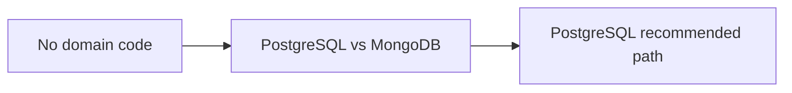
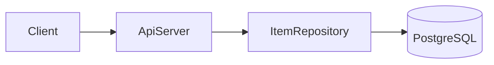
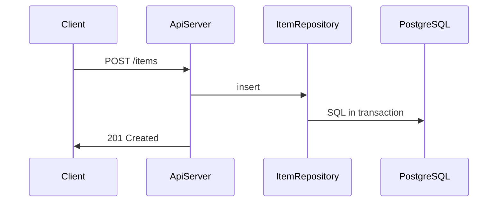
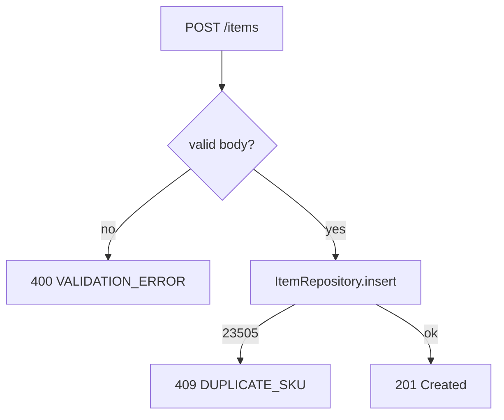

# Fork Sample — Technical Design Document

## 목차

1. [Overview](#1-overview)
2. [Background](#2-background)
3. [Requirements](#3-requirements)
4. [Starting Point](#4-starting-point)
5. [Proposed Solution](#5-proposed-solution)
6. [Alternatives Considered](#6-alternatives-considered)
7. [Detailed Design](#7-detailed-design)
8. [Rollout and Open Items](#8-rollout-and-open-items)
- [부록 A. 출처·코드 위치](#부록-a-출처코드-위치)
- [부록 B. Ch.6 결정 전문](#부록-b-ch6-결정-전문)

## How to Read This Doc

### 설계 계층 (필독)

| 계층 | 장 | 내용 |
|------|-----|------|
| 요구 | Ch.3 [Requirements](#3-requirements) | FR/RTM |
| 시작점 | Ch.4 [Starting Point](#4-starting-point) | Greenfield scaffold |
| 개념설계 | Ch.5 [Proposed Solution](#5-proposed-solution) | HLD (권장 경로 기준) |
| 설계 결정 | Ch.6 [Alternatives Considered](#6-alternatives-considered) | ADR·datastore 갈림 |
| 상세 | Ch.7 [Detailed Design](#7-detailed-design) | API·AC·테스트 |

본문 순서는 Ch.5(Proposed)→Ch.6(Alternatives)→Ch.7(Detailed).

| 독자 | 먼저 볼 곳 | 목표 |
|------|-----------|------|
| PM | ## 1. Overview opening + Goals → [§7](#5-proposed-solution) mermaid | \~3분 |
| Dev (구현) | [§7](#5-proposed-solution) → [§7](#6-alternatives-considered) → [§7](#7-detailed-design) 스펙 표 | \~5분 |
| 감사 | [§7](#6-alternatives-considered) 갈림 block → [부록 A](#부록-a-출처코드-위치) | \~3분 |

## 1. Overview

이 문서는 greenfield items CRUD API의 기술 설계를 PM, 백엔드 개발자, 감사 담당자가 공유하기 위해 작성한다. PRD는 cross-entity 트랜잭션이 가능한 primary datastore와 REST CRUD를 요구한다. PostgreSQL과 MongoDB 사이의 datastore 갈림이 남아 있으며, 본문은 PostgreSQL 권장 경로를 기준으로 서술한다. 최종 datastore 선택은 Ch.8 열린 질문에서 확정한다. v1은 internal network 전용이며 public auth는 범위 밖이다.

### Goals / Non-Goals

**Goals:**
- items REST CRUD with transactional writes
- PostgreSQL(권장) relational model
- health endpoint for k8s

**Non-Goals:**
- Public auth in v1 (internal network only)
- Message queue / event bus

## 2. Background

PRD는 items 엔티티에 대한 REST CRUD API와 영속 저장소를 요구한다. 모든 write는 cross-entity 트랜잭션 경계 안에서 일관되게 커밋되어야 한다. 동일 sku 중복 생성과 부분 실패 rollback은 운영에서 반드시 막아야 하는 실패 모드이다. 대상 스택은 Node 20과 TypeScript이며, 배포 환경은 Kubernetes liveness probe를 전제로 한다.

v1 범위는 internal network에서 Bearer 인증 없이 호출 가능한 API로 한정한다. message queue나 event bus는 이번 릴리스 Non-Goal이다. health endpoint는 프로브 실패 시 트래픽 차단을 위해 필수이다.

이 요구는 relational ACID 또는 동등한 트랜잭션 보장을 갖는 datastore 선택으로 이어진다.

## 3. Requirements

PRD items CRUD를 FR/NFR/제약으로 정리한다. greenfield이므로 구현 상태 열은 두지 않으며, Ch.6 datastore 갈림의 근거가 된다.

FR-1은 REST CRUD endpoint를, FR-2는 cross-entity write의 단일 트랜잭션 커밋을 요구한다. NFR-1은 Kubernetes liveness용 health endpoint를 정의한다.

v1은 internal network만 대상으로 Bearer 인증은 Non-Goal이다. message queue·event bus도 범위 밖이다.

RTM은 FR→AC→테스트 추적의 초안이다. 다음 장(Ch.4)에서 scaffold 시작점을 기술한다. datastore 최종 확정 전까지는 Ch.8 Open Items에 MongoDB 대안 검토를 유지한다.

#### 기능 요구 (FR)

| FR ID | PRD | 요구 설명 (shall) | 우선순위 | 비고 |
|-------|-----|-------------------|----------|------|
| FR-1 | [source:prd#items-crud] | items REST CRUD API를 제공해야 한다 | Must | Ch.7 API |
| FR-2 | [source:prd#transaction] | cross-entity write는 단일 트랜잭션으로 커밋되어야 한다 | Must | Ch.6 datastore |

#### 비기능 요구 (NFR)

| NFR ID | PRD | 요구 | 목표치 | 검증 방법 (개략) |
|--------|-----|------|--------|------------------|
| NFR-1 | [source:prd#health] | Kubernetes liveness용 health endpoint | 200 OK | integration probe |

#### 제약·가정·의존성

| 유형 | ID | 내용 | 영향 |
|------|-----|------|------|
| 제약 | CON-1 | v1 public auth 없음, internal network only | 범위 |

#### 추적성 매트릭스 (RTM)

| PRD 앵커 | REQ ID | (예정) AC ID | 설계 반영 (Ch.5–7) | 테스트 |
|----------|--------|--------------|-------------------|--------|
| [source:prd#items-crud] | FR-1 | AC-1 | ApiServer REST routes | T-1 |
| [source:prd#transaction] | FR-2 | AC-2 | ItemRepository transactional writes | T-2 |

## 4. Starting Point

PRD가 요구하는 items CRUD와 트랜잭션 일관성을 구현할 도메인 코드는 아직 존재하지 않는다. 저장소에는 Node 20과 TypeScript 보일러플레이트만 있으며, `package.json`에 express 4.x와 typescript가 선언되어 있다. `src/` 디렉터리는 비어 있어 HTTP handler, repository, schema migration 코드가 모두 미구현 상태이다.

런타임 의존성은 express 4.x 하나이며 DB driver나 ORM은 아직 추가되지 않았다 [ref:A-1]. CI는 lint와 typecheck만 실행하며 integration test harness도 없다. express boilerplate만으로는 PRD items CRUD를 충족할 수 없다.

따라서 Ch.5에서 목표 구조를 먼저 제시하고 Ch.6에서 datastore Tier-1을 확정해야 구현 착수가 가능하다. greenfield 전제 하에서 Ch.6·7는 신규 **ApiServer**, **ItemRepository**, **PostgreSQL** 조합을 가정한다.

## 5. Proposed Solution

미구현 DB layer와 PRD cross-entity transaction 요구 때문에 primary datastore 선택이 첫 번째 설계 갈림이다. PRD cross-entity transaction 요구는 단일 DB transaction으로 item write를 묶을 수 있는 relational store에 유리하다. MongoDB는 스키마 유연성은 높지만 multi-document ACID는 운영 복잡도와 버전 제약이 따른다.

PostgreSQL은 ACID transaction과 UNIQUE constraint를 SQL 표준으로 제공한다. v1은 단일 **ApiServer** 프로세스와 단일 PostgreSQL instance로 수평 복잡도를 낮춘다. 인증·메시징은 Non-Goal이므로 아래 목표 구조는 PostgreSQL 권장 경로를 전제로 한다.

### Architecture Overview

HTTP clients는 **ApiServer** 한 프로세스에 REST 요청을 보낸다. **ApiServer**는 validation과 routing 후 **ItemRepository**를 통해 **PostgreSQL**에 SQL을 실행한다. v1에는 message queue나 read replica가 없으며, 모든 write는 primary DB transaction 안에서 처리한다 [ref:A-2].

### Components and Responsibilities

세 구성요소가 HTTP ingress부터 ACID persistence까지 책임을 나눈다. **ApiServer**는 Express routing과 payload validation을 담당한다. **ItemRepository**는 items 테이블 CRUD SQL을 캡슐화한다. **PostgreSQL**은 relational persistence와 transaction boundary를 제공한다 [ref:A-3].

- **ApiServer** (신규): Express HTTP, routing, validation, ItemRepository 호출
- **ItemRepository** (신규): SQL access layer for items table
- **PostgreSQL** (신규): relational persistence, ACID transactions

### Data Flow

Client CRUD 요청은 **ApiServer** → **ItemRepository** → **PostgreSQL** 순으로 동기 처리된다. validation 실패는 DB 호출 전에 400으로 종료하고, sku UNIQUE violation은 409로 매핑한다. 모든 successful write path는 단일 DB transaction으로 commit된다 [ref:A-4].

1. Client → **ApiServer**: HTTP request + JSON body
2. **ApiServer**: validate payload, map to domain call
3. **ApiServer** → **ItemRepository**: create/read/update/delete
4. **ItemRepository** → **PostgreSQL**: SQL within transaction
5. **ApiServer** → Client: JSON response + HTTP status

Ch.5 목표 구조를 구현하려면 primary datastore Tier-1을 본 장에서 ADR 형식으로 기록해야 한다.

## 6. Alternatives Considered

Ch.5 개념설계는 PostgreSQL 권장 경로의 2-tier 구조를 보여 준다. 본 장은 primary datastore Tier-1 갈림을 ADR 형식으로 기록한다.

PostgreSQL은 PRD cross-entity transaction에 ACID transaction과 UNIQUE constraint를 제공한다. MongoDB는 스키마 유연성은 높지만 multi-document ACID는 운영 복잡도가 따른다. 상태는 권장(미확정)이며 확정 전까지 Ch.8 열린 질문에 MongoDB 대안 검토 항목을 유지한다.

v1은 단일 **ApiServer**와 단일 PostgreSQL instance로 수평 복잡도를 낮춘다. 확정 후 repository layer만 교체 가능하도록 HTTP와 persistence 경계를 분리한다. 감사 독자는 아래 갈림 block과 부록 B에서 공식 문서 근거를 확인한다.

### Decision Summary

| # | 주제 | 선택 | 상태 | 상세 |
|---|------|------|------|------|
| 1 | Primary datastore | PostgreSQL (권장) | 권장(미확정) | 아래 **갈림** block |

> **갈림:** Primary datastore
> **대안:** (A) PostgreSQL — ACID (B) MongoDB — flexible schema
> **권장:** (A) PostgreSQL — PRD cross-entity transactions
> **근거:** [source:pg](https://www.postgresql.org/docs/current/tutorial-transactions.html)
> **코드:** (Greenfield — 코드 없음)
> **상태:** 권장(미확정)

Ch.6 Alternatives에서 권장한 PostgreSQL 경로에 따라, Ch.7에서는 API·entity·인수조건·테스트를 구현 가능한 수준으로 내린다.

## 7. Detailed Design

Ch.5 Proposed Solution의 **ApiServer**, **ItemRepository**, **PostgreSQL** 조합을 endpoint, entity, error code 수준까지 내린다. 아래 표는 dev reader가 Ch.7 본문으로 바로 점프할 때 사용하는 인덱스이다.

| Endpoint / Interface | Entity | Error codes |
|----------------------|--------|-------------|
| GET /health | — | — |
| POST /items | items | 400, 409 |

### APIs and Interfaces

items REST API는 v1 internal network 전용이며 Bearer 인증을 요구하지 않는다. **ApiServer**는 path-based Express routing으로 handler를 매핑한다. health endpoint는 k8s liveness probe용으로 auth 없이 200을 반환한다 [ref:A-5].

#### `GET /health`

| Field | Type | Required | Note |
|-------|------|----------|------|
| — | — | — | liveness, no auth |

#### `POST /items`

| Field | Type | Required | Note |
|-------|------|----------|------|
| name | string | yes | item display name |
| sku | string | yes | unique per tenant |

| Code | HTTP | When | Client action | Retry? |
|------|------|------|---------------|--------|
| VALIDATION_ERROR | 400 | invalid body | fix payload | no |
| DUPLICATE_SKU | 409 | sku exists | use new sku | no |

### Data Model

**PostgreSQL** relational model 기준 items 테이블은 uuid primary key와 sku UNIQUE constraint를 가진다. created_at은 insert 시점 timestamptz default now()로 기록한다 [ref:A-6].

#### `items`

| Field | Type | Nullable | Constraint | Notes |
|-------|------|----------|------------|-------|
| id | uuid | no | PK | gen_random_uuid() |
| name | varchar(255) | no | | |
| sku | varchar(64) | no | UNIQUE | |
| created_at | timestamptz | no | default now() | |

### Core Processing Flow

**ApiServer** create item flow는 validation → **ItemRepository**.insert → commit 순서를 따른다. DB constraint error는 HTTP semantics에 맞게 매핑하고 transaction rollback으로 partial write를 방지한다 [ref:A-7].

**Happy path:** **ApiServer** validates POST body → **ItemRepository**.insert → commit → 201.

**Errors:**
- Validation failure → 400 VALIDATION_ERROR before **ItemRepository** call
- **PostgreSQL** unique violation on sku → 409 DUPLICATE_SKU; transaction rollback

### Acceptance Criteria

AC는 items CRUD v1의 완료 정의이다. create happy path와 sku 중복 거부는 PRD items 요구의 최소 단위이며, 각 Must AC는 integration test로 증명하고 health endpoint smoke는 별도 CI job으로 유지한다 [ref:A-4].

| AC ID | PRD | 인수조건 | 우선순위 | 완료 판정 |
|-------|-----|----------|----------|-----------|
| AC-1 | [source:prd#items] | Given valid POST body When create Then 201 + persisted row in items | Must | Test T-1 passes |
| AC-2 | [source:prd#items] | Given duplicate sku When create Then 409 DUPLICATE_SKU, no partial row | Must | Test T-2 passes |

### Tests

Greenfield harness는 `tests/integration/`에 supertest + testcontainers PostgreSQL을 사용한다. Must AC(T-1, T-2)는 CI merge gate에 포함하며, PR merge 전 `npm run test:integration`이 green이어야 한다 [ref:A-5].

| Test ID | AC ID | Layer | 시나리오 | Fixture / Mock | CI gate |
|---------|-------|-------|----------|----------------|---------|
| T-1 | AC-1 | integration | POST /items happy path | testcontainers PG | yes |
| T-2 | AC-2 | integration | duplicate sku insert | seeded sku row | yes |

## 8. Rollout and Open Items

### Rollout and Milestones

Primary datastore 최종 확정 후 migration 일정과 **ApiServer** deploy 순서를 잡는다. PostgreSQL schema migration 적용 뒤 **ApiServer**를 internal network에 배포한다. 확정 전까지 staging DB는 권장 경로인 PostgreSQL로 provision한다.

### Risks

| Risk | Impact | Mitigation |
|------|--------|------------|
| Wrong DB choice | migration cost | Ch.8 open question |
| No auth on v1 | internal only | document network boundary |

### Open Questions

- **최종 선택 필요:** Primary datastore — PostgreSQL(권장) vs MongoDB

## 부록 A. 출처·코드 위치

| ID | 주장 | PRD | Code | External URL |
|----|------|-----|------|--------------|
| A-1 | express 4.x runtime dependency | [source:prd#stack] | `package.json:14-20` | |
| A-2 | PostgreSQL 권장 datastore 가정 | [source:prd#data] | (Greenfield — 코드 없음) | |
| A-3 | ItemRepository CRUD 캡슐화 | [source:prd#items] | (Greenfield — 코드 없음) | |
| A-4 | CRUD 단일 transaction | [source:prd#items] | (Greenfield — 코드 없음) | |
| A-5 | Express path-based routing | | (Greenfield — 코드 없음) | https://expressjs.com/en/guide/routing.html |
| A-6 | items relational model | | (Greenfield — 코드 없음) | https://www.postgresql.org/docs/current/ddl.html |
| A-7 | UNIQUE violation SQLSTATE 23505 | | (Greenfield — 코드 없음) | https://www.postgresql.org/docs/current/errcodes-appendix.html |

## 부록 B. Ch.7 결정 전문

> **갈림:** Primary datastore
> **대안:** (A) PostgreSQL — ACID (B) MongoDB — flexible schema
> **권장:** (A) PostgreSQL — PRD cross-entity transactions
> **근거:** [source:pg](https://www.postgresql.org/docs/current/tutorial-transactions.html)
> **코드:** (Greenfield — 코드 없음)
> **상태:** 권장(미확정)
