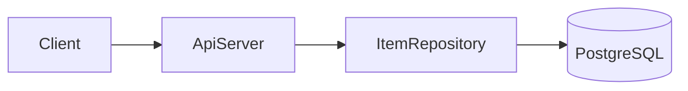

# Fork Sample — Technical Design Document

## 1. 서문

Doc for validator and skill regression test. PM and dev readers validate fork + strict depth + readability profiles.

### TL;DR

Greenfield items CRUD API needs a primary datastore with cross-entity transactions. PostgreSQL(권장) vs MongoDB 갈림이 있으며 PostgreSQL을 권장한다. ApiServer + ItemRepository + PostgreSQL 2-tier로 v1을 구현한다.

### Goals / Non-Goals

**Goals:**
- items REST CRUD with transactional writes
- PostgreSQL(권장) relational model
- health endpoint for k8s

**Non-Goals:**
- Public auth in v1 (internal network only)
- Message queue / event bus

### 이 문서 읽는 법

| 독자 | 먼저 볼 곳 | 목표 |
|------|-----------|------|
| PM | TL;DR → [§5](#5-상위설계) diagram | ~2분 |
| Dev | [§4](#4-설계-결정) → [§6](#6-상세설계) 스펙 인덱스 | ~5분 |
| 감사 | [§4](#4-설계-결정) 결정 요약 → [부록 A](#부록-a-출처코드-위치) | ~3분 |

### 목차

1. [서문](#1-서문)
2. [배경과 문제](#2-배경과-문제)
3. [시작점](#3-시작점)
4. [설계 결정](#4-설계-결정)
5. [상위설계](#5-상위설계)
6. [상세설계](#6-상세설계)
7. [마무리](#7-마무리)
- [부록 A. 출처·코드 위치](#부록-a-출처코드-위치)
- [부록 B. Ch.4 결정 전문](#부록-b-ch4-결정-전문)

## 2. 배경과 문제

요약: Greenfield API needs persistent storage for items CRUD.

PRD requires transactional consistency across item writes. Stack is Node 20 + TypeScript.

## 3. 시작점

요약: 도메인 코드는 없고 Node 20 + TypeScript 보일러플레이트만 있다.

`package.json`에 express와 typescript가 선언되어 있다. `src/` 디렉터리는 비어 있다. 런타임 의존성은 express 4.x이다 [ref:A-1].

## 4. 설계 결정

요약: Primary datastore는 PostgreSQL(권장) vs MongoDB 갈림이며, 트랜잭션 요구로 PostgreSQL을 권장한다.

### 결정 요약

| # | 주제 | 선택 | 상태 | 상세 |
|---|------|------|------|------|
| 1 | Primary datastore | PostgreSQL (권장) | 권장(미확정) | 아래 **갈림** block |

> **갈림:** Primary datastore
> **대안:** (A) PostgreSQL — ACID (B) MongoDB — flexible schema
> **권장:** (A) PostgreSQL — PRD cross-entity transactions
> **근거:** [source:pg](https://www.postgresql.org/docs/current/tutorial-transactions.html)
> **코드:** (Greenfield — 코드 없음)
> **상태:** 권장(미확정)

## 5. 상위설계

### 아키텍처 개요

요약: PostgreSQL 기준 단일 **ApiServer** 프로세스 + **PostgreSQL** 2-tier.

HTTP clients call **ApiServer** (API layer). **ApiServer** persists via **PostgreSQL** (data layer). No message queue in v1 [ref:A-2].

#### 한눈에
- 단일 ApiServer 프로세스가 HTTP를 처리한다
- ItemRepository가 SQL access를 캡슐화한다
- PostgreSQL이 ACID persistence를 제공한다

### 구성요소 및 책임

요약: ApiServer·ItemRepository·PostgreSQL 세 구성요소가 HTTP와 persistence를 담당한다.

- **ApiServer** (신규): Express HTTP, routing, validation, ItemRepository 호출
- **ItemRepository** (신규): SQL access layer for items table
- **PostgreSQL** (신규): relational persistence, ACID transactions [ref:A-3]

#### 한눈에
- ApiServer는 Express routing만 담당한다
- ItemRepository는 items 테이블 CRUD를 캡슐화한다
- PostgreSQL은 권장 datastore 가정이다

### 데이터 흐름

요약: Client CRUD는 ApiServer → ItemRepository → PostgreSQL 순으로 처리한다.

1. Client → **ApiServer**: HTTP request + JSON body
2. **ApiServer**: validate payload, map to domain call
3. **ApiServer** → **ItemRepository**: create/read/update/delete
4. **ItemRepository** → **PostgreSQL**: SQL within transaction
5. **ApiServer** → Client: JSON response + HTTP status

CRUD 요청은 단일 트랜잭션으로 ItemRepository를 통해 PostgreSQL에 기록한다 [ref:A-4].

#### 한눈에
- 모든 write는 단일 DB transaction이다
- validation 실패 시 DB 호출 전에 400을 반환한다
- sku UNIQUE violation은 409로 매핑한다

## 6. 상세설계

### 스펙 인덱스

| Endpoint / Interface | Entity | Error codes |
|----------------------|--------|-------------|
| GET /health | — | — |
| POST /items | items | 400, 409 |

### API 및 인터페이스

요약: items REST API는 Bearer 인증 없이 v1 internal; health endpoint for k8s.

#### `GET /health`

| Field | Type | Required | Note |
|-------|------|----------|------|
| — | — | — | liveness, no auth |

#### `POST /items`

| Field | Type | Required | Note |
|-------|------|----------|------|
| name | string | yes | item display name |
| sku | string | yes | unique per tenant |

| Code | HTTP | When | Client action | Retry? |
|------|------|------|---------------|--------|
| VALIDATION_ERROR | 400 | invalid body | fix payload | no |
| DUPLICATE_SKU | 409 | sku exists | use new sku | no |

Express routing은 path-based handler 매핑을 사용한다 [ref:A-5].

### 데이터 모델

요약: items 테이블은 uuid PK와 unique sku를 가진다.

#### `items`

| Field | Type | Nullable | Constraint | Notes |
|-------|------|----------|------------|-------|
| id | uuid | no | PK | gen_random_uuid() |
| name | varchar(255) | no | | |
| sku | varchar(64) | no | UNIQUE | |
| created_at | timestamptz | no | default now() | |

items 테이블은 PostgreSQL relational model을 따른다 [ref:A-6].

### 핵심 처리 흐름

요약: **ApiServer** create item flow with validation and DB constraint errors.

**Happy path:** **ApiServer** validates POST body → **ItemRepository**.insert → commit → 201.

**Errors:**
- Validation failure → 400 VALIDATION_ERROR before **ItemRepository** call
- **PostgreSQL** unique violation on sku → 409 DUPLICATE_SKU; transaction rollback

UNIQUE constraint violation은 SQLSTATE 23505로 식별한다 [ref:A-7].

## 7. 마무리

### 롤아웃·일정

TBD after DB choice confirmed. Deploy ApiServer after PostgreSQL schema migration.

### 리스크

| Risk | Impact | Mitigation |
|------|--------|------------|
| Wrong DB choice | migration cost | Ch.7 open question |
| No auth on v1 | internal only | document network boundary |

### 열린 질문

- **최종 선택 필요:** Primary datastore — PostgreSQL(권장) vs MongoDB

## 부록 A. 출처·코드 위치

| ID | 주장 | PRD | Code | External URL |
|----|------|-----|------|--------------|
| A-1 | express 4.x runtime dependency | [source:prd#stack] | `package.json:14-20` | |
| A-2 | PostgreSQL 권장 datastore 가정 | [source:prd#data] | (Greenfield — 코드 없음) | |
| A-3 | ItemRepository CRUD 캡슐화 | [source:prd#items] | (Greenfield — 코드 없음) | |
| A-4 | CRUD 단일 transaction | [source:prd#items] | (Greenfield — 코드 없음) | |
| A-5 | Express path-based routing | | (Greenfield — 코드 없음) | https://expressjs.com/en/guide/routing.html |
| A-6 | items relational model | | (Greenfield — 코드 없음) | https://www.postgresql.org/docs/current/ddl.html |
| A-7 | UNIQUE violation SQLSTATE 23505 | | (Greenfield — 코드 없음) | https://www.postgresql.org/docs/current/errcodes-appendix.html |

## 부록 B. Ch.4 결정 전문

> **갈림:** Primary datastore
> **대안:** (A) PostgreSQL — ACID (B) MongoDB — flexible schema
> **권장:** (A) PostgreSQL — PRD cross-entity transactions
> **근거:** [source:pg](https://www.postgresql.org/docs/current/tutorial-transactions.html)
> **코드:** (Greenfield — 코드 없음)
> **상태:** 권장(미확정)
