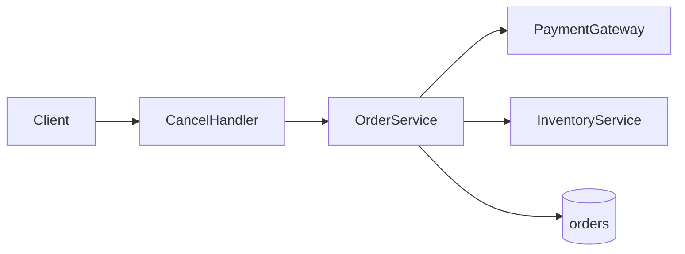

# 주문 취소 API — Technical Design Document

## 1. 서문

### 목차

1. [서문](#1-서문)
2. [배경과 문제](#2-배경과-문제)
3. [현재 시스템](#3-현재-시스템)
4. [갭과 설계 전환](#4-갭과-설계-전환)
5. [상위설계](#5-상위설계)
6. [상세설계](#6-상세설계)
7. [마무리](#7-마무리)
- [부록 A. 출처·코드 위치](#부록-a-출처코드-위치)
- [부록 B. Ch.4 결정 전문](#부록-b-ch4-결정-전문)

### 이 문서 읽는 법

| 독자 | 먼저 볼 곳 | 목표 |
|------|-----------|------|
| PM | Ch.1 opening + Goals → [§5](#5-상위설계) diagram | ~3분 |
| Dev | [§4](#4-갭과-설계-전환) → [§6](#6-상세설계) dev index + tables | ~5분 |
| 감사 | [§4](#4-갭과-설계-전환) 결정 요약 → [부록 A](#부록-a-출처코드-위치) | ~3분 |

이 문서는 B2C 웹 주문 API에 주문 취소 기능을 추가하기 위한 기술 설계서이다. PM, 백엔드 개발자, 감사 담당자가 동일한 사실을 공유하도록 PRD `docs/prd/order-cancel.md`를 2026-05-25 기준으로 반영한다. paid 상태 취소 시 Stripe 환불과 재고 복구가 함께 일어나야 하며, Idempotency-Key로 중복 취소를 안전하게 처리한다. Staging에서 1주 검증 후 feature flag `cancel_refund_enabled`로 production에 점진 롤아웃한다.

### Goals / Non-Goals

**Goals:**
- paid/pending 주문 취소 API 제공
- Stripe 환불 및 재고 복구 orchestration
- Idempotent cancel (Idempotency-Key)

**Non-Goals:**
- partial refund 정책 (PRD 미정)
- B2B·관리자 bulk cancel

## 2. 배경과 문제

B2C 웹 쇼핑몰 고객은 결제 완료 전·후 특정 조건에서 주문을 스스로 취소할 수 있어야 한다. PRD는 pending과 paid 상태에서 취소를 허용하며, 취소 시 line item 기준 재고 복구를 요구한다. paid 상태에서는 결제 금액 전액 환불이 선행되어야 하고, 환불 실패 시 주문 상태는 변경되지 않아야 한다. 범위는 B2C 웹 주문 API이며 B2B·관리자 bulk cancel은 이번 릴리스에서 제외한다 [ref:A-1]. 고객 지원팀은 취소 API 응답만으로 주문·환불·재고 상태를 설명할 수 있어야 한다. 동일 Idempotency-Key로 재시도해도 중복 환불이 발생하지 않아야 한다. PRD cancel-flow는 paid 취소 시 환불 후 재고 복구 순서를 명시한다. 이러한 요구는 OrderService와 PaymentGateway, InventoryService 간 orchestration을 필요로 한다.

## 3. 현재 시스템

현재 B2C 주문 API는 `POST /orders/{id}/cancel` endpoint를 제공한다. CancelHandler가 JWT 인증 후 OrderService.cancel에 위임한다. OrderService는 주문 status를 cancelled로 변경하고 cancelled_at을 기록한다. PaymentGateway 연동은 없으며 paid 주문 취소 시 Stripe 환불은 발생하지 않는다 [ref:A-2]. InventoryService.release 호출도 cancel path에 포함되어 있지 않아 재고는 복구되지 않는다. Idempotency-Key header는 CancelHandler에서 수신하지만 OrderService까지 전달되지 않는다. orders 테이블에는 payment_intent_id 컬럼이 있으나 취소 로직에서 사용되지 않는다. status enum은 pending, paid, shipped, delivered, cancelled 다섯 값으로 정의되어 있다 [ref:A-7]. PRD가 요구하는 paid 취소 시 환불·재고 복구 orchestration은 현재 미구현이다.

## 4. 갭과 설계 전환

PRD는 paid 상태 취소 시 환불을 필수로 요구하지만, 현재 OrderService.cancel은 status 변경만 수행한다. 재고 복구와 Idempotency-Key 전파도 PRD cancel-flow와 일치하지 않는다. 따라서 PaymentGateway.refund 연동과 InventoryService.release 호출을 OrderService orchestration에 추가해야 한다. Stripe refund API는 payment_intent_id 기준이며, timeout 시 retry queue에 job을 적재하는 패턴을 채택한다 [ref:A-3]. PG timeout 시 클라이언트는 동일 Idempotency-Key로 안전하게 재시도할 수 있어야 한다. InventoryService.release 실패 시에는 compensating refund로 데이터 정합성을 유지한다. brownfield 제약 하에 CancelHandler와 OrderService, InventoryService는 기존 모듈을 확장하고 PaymentGateway만 신규 추가한다. Ch.5 상위설계는 이 결정을 API → Service → External 3계층 구조로 구체화한다.

### 결정 요약

| # | 주제 | 선택 | 상태 | 상세 |
|---|------|------|------|------|
| 1 | 환불 연동 | PaymentGateway.refund | 확정 | 아래 **결정** block |

> **결정:** 취소 API에 PaymentGateway.refund 호출을 추가한다.
> **근거:** [source:stripe-refunds](https://stripe.com/docs/api/refunds)
> **코드:** `src/orders/cancel_handler.ts:18`
> **상태:** 확정

## 5. 상위설계

Ch.4 결정에 따라 PaymentGateway.refund 연동을 B2C 주문 취소 3계층 상위설계로 펼친다. 클라이언트 요청은 API layer에서 JWT 인증 후 Service layer로 전달되고, External layer에서 Stripe PG와 InventoryService 내부 API를 호출한다. paid 분기에서만 환불이 발생하며 pending 취소는 status 전이와 재고 복구만 수행한다.

### 아키텍처 개요

B2C 주문 취소는 CancelHandler → OrderService → PaymentGateway·InventoryService 3계층으로 처리한다. API layer는 HTTP 경계와 인증을 담당하고, Service layer는 상태 전이 orchestration을 수행한다. Data layer는 PostgreSQL orders 테이블에 최종 상태를 저장한다 [ref:A-3].

### 구성요소 및 책임

취소·환불·재고 복구는 CancelHandler, OrderService, PaymentGateway, InventoryService 네 구성요소가 분담한다. CancelHandler는 HTTP 경계만 담당하고 OrderService가 paid 분기와 재고 호출을 orchestration한다. PaymentGateway는 신규 Stripe 연동 모듈이며 InventoryService는 기존 재고 API를 재사용한다 [ref:A-4].

- **CancelHandler** (기존): `POST /orders/{id}/cancel` HTTP, 입력 검증, Idempotency-Key 전달
- **OrderService** (기존): 주문 상태 전이 orchestration, paid 분기에서 PaymentGateway 호출
- **PaymentGateway** (신규): Stripe refund API 호출, PG timeout 시 retry queue enqueue
- **InventoryService** (기존): line item 기준 재고 release [ref:A-4]

### 데이터 흐름

취소 요청은 인증 → 상태 검증 → (paid 시) 환불 → 재고 복구 → DB 저장 순으로 처리한다. happy path는 동기 호출 5단계이며 paid일 때만 PaymentGateway를 호출한다. 최종 DB commit 전에 재고 복구를 완료하여 PRD cancel-flow와 일치시킨다 [ref:A-5].

1. Client → **CancelHandler**: `POST /orders/{id}/cancel` + JWT
2. **CancelHandler** → **OrderService**: cancel(orderId)
3. **OrderService**: status 검증; paid이면 **PaymentGateway**.refund (sync)
4. **OrderService** → **InventoryService**.release (sync)
5. **OrderService** → DB: status=cancelled, cancelled_at (sync)

## 6. 상세설계

Ch.5에서 정의한 구성요소를 endpoint, entity, error branch 수준으로 구체화한다. 아래 표는 개발자가 Ch.6 본문을 스캔할 때 endpoint·entity·error code를 한눈에 찾기 위한 인덱스이다.

| Endpoint / Interface | Entity | Error codes |
|----------------------|--------|-------------|
| POST /orders/{id}/cancel | orders | 404, 409, 502 |

### API 및 인터페이스

CancelHandler는 JWT 검증 후 OrderService에 위임하며, cancel endpoint는 Bearer 인증과 Idempotency-Key를 지원한다. paid 상태일 때만 OrderService가 PaymentGateway.refund를 트리거한다 [ref:A-6].

#### `POST /orders/{id}/cancel`

| Field | Type | Required | Note |
|-------|------|----------|------|
| id | path UUID | yes | order id |
| Idempotency-Key | header string | no | duplicate cancel safe |
| Authorization | header Bearer | yes | JWT access token |

| Code | HTTP | When | Client action | Retry? |
|------|------|------|---------------|--------|
| ORDER_NOT_FOUND | 404 | invalid id | fix request | no |
| ALREADY_CANCELLED | 409 | status cancelled | show status | no |
| PAYMENT_TIMEOUT | 502 | PG timeout | retry with same key | yes |

Idempotency-Key 중복 시 동일 200 응답을 반환한다 [ref:A-6].

### 데이터 모델

orders 테이블은 status enum과 cancelled_at, payment_intent_id를 PRD order-status와 Stripe refund 요구에 맞게 유지한다. migration V004에서 cancelled_at 컬럼을 추가한다 [ref:A-7].

#### `orders`

| Field | Type | Nullable | Constraint | Notes |
|-------|------|----------|------------|-------|
| id | uuid | no | PK | |
| status | enum | no | pending/paid/cancelled/… | PRD §order-status |
| payment_intent_id | string | yes | FK logical → Stripe | paid orders only |
| cancelled_at | timestamptz | yes | set on cancel | migration V004 |

status enum은 pending, paid, shipped, delivered, cancelled 다섯 값이다 [ref:A-7].

### 핵심 처리 흐름

OrderService.cancel은 happy path와 PG·재고 실패 분기를 처리한다. PaymentGateway timeout과 InventoryService.release 실패 각각에 대해 보상·retry 정책을 적용한다 [ref:A-8].

**Happy path:** **OrderService** loads order → reject if cancelled → if paid call **PaymentGateway**.refund → **InventoryService**.release → persist cancelled + cancelled_at.

**Errors:**
- **PaymentGateway** timeout → enqueue retry job, return 502 PAYMENT_TIMEOUT; client may retry with Idempotency-Key
- **InventoryService**.release failure → compensating refund call, return 500 INVENTORY_RELEASE_FAILED; no status change

PG timeout 시 retry queue에 refund job을 적재한다 [ref:A-8].

## 7. 마무리

### 롤아웃·일정

Staging 1주 검증 후 production. Feature flag `cancel_refund_enabled`.

### 리스크

| Risk | Impact | Mitigation |
|------|--------|------------|
| PG timeout | 취소 stuck | retry queue + 502 to client |
| Partial refund policy gap | CS 혼선 | Ch.7 열린 질문으로 확정 대기 |

### 열린 질문

- partial refund 정책은 PRD에 미정의이다.

## 부록 A. 출처·코드 위치

| ID | 주장 | PRD | Code | External URL |
|----|------|-----|------|--------------|
| A-1 | PRD 범위는 B2C 웹 주문 API | [source:prd#scope] | | |
| A-2 | 취소 시 status만 cancelled로 변경 | [source:prd#cancel-flow] | `src/orders/cancel_handler.ts:8-22` | |
| A-3 | Stripe refund는 payment_intent 기준 | | `src/orders/cancel_handler.ts:18` | https://stripe.com/docs/api/refunds |
| A-4 | InventoryService.release가 재고 복구 | [source:prd#inventory] | `src/inventory/service.ts:40-55` | |
| A-5 | paid 취소 시 환불 후 재고 복구 순서 | [source:prd#cancel-flow] | `src/orders/cancel_handler.ts:8-22` | |
| A-6 | Idempotency-Key 중복 시 동일 200 | | `src/orders/cancel_handler.ts:8` | https://stripe.com/docs/api/idempotent_requests |
| A-7 | status enum 5값 | [source:prd#order-status] | `src/orders/state.ts:12-28` | |
| A-8 | PG timeout 시 retry queue 적재 | [source:prd#cancel-flow] | `src/orders/cancel_handler.ts:18` | |

## 부록 B. Ch.4 결정 전문

> **결정:** 취소 API에 PaymentGateway.refund 호출을 추가한다.
> **근거:** [source:stripe-refunds](https://stripe.com/docs/api/refunds)
> **코드:** `src/orders/cancel_handler.ts:18`
> **상태:** 확정
