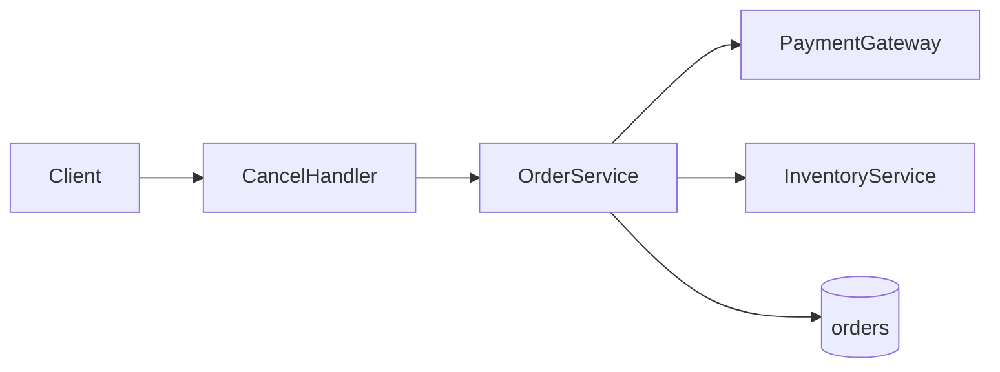

# TDD Readability Profile Implementation Plan

> **For agentic workers:** REQUIRED SUB-SKILL: Use superpowers:subagent-driven-development (recommended) or superpowers:executing-plans to implement this plan task-by-task. Steps use checkbox (`- [ ]`) syntax for tracking.

**Goal:** Implement the triple-audience readability profile for `prd-to-tdd` output — expanded Ch.1 entry, Ch.4/5/6 scan lanes, Appendix A/B citations, and `--readability` validation — without weakening existing strict depth gates.

**Architecture:** Update reference markdown (template, rules, examples) first; then adjust `validate-tdd.py` so strict depth no longer requires inline Ch.5–6 blockquotes; add parallel `check_readability()` behind `--readability`; migrate both sample TDDs; wire SKILL Phase 4/5 and subagent prompts.

**Tech Stack:** Python 3 (`validate-tdd.py`), Markdown skill refs under `prd-to-tdd/`, sample fixtures in `docs/design/`.

**Spec:** `docs/superpowers/specs/2026-05-25-tdd-readability-design.md`

---

## File Map

| File | Responsibility |
|------|----------------|
| `prd-to-tdd/tdd-template.md` | Authoritative output skeleton (Ch.1, appendices, mermaid, spec index) |
| `prd-to-tdd/narrative-rules.md` | Forward-only + static anchors + `#### 한눈에` |
| `prd-to-tdd/citation-tiers.md` | Tier-2 → Appendix A policy |
| `prd-to-tdd/design-sections.md` | Ch.6 reference mode + readability rubric |
| `prd-to-tdd/examples.md` | Good/bad readability excerpts |
| `prd-to-tdd/subagent-prompts.md` | narrative-reviewer items 18–22 |
| `prd-to-tdd/SKILL.md` | Phase 4 appendix steps; Phase 5 dual validation |
| `prd-to-tdd/scripts/validate-tdd.py` | `check_readability()`, CLI flags, relaxed source rules |
| `prd-to-tdd/scripts/test_validate_tdd.py` | Unit tests (stdlib `unittest`) |
| `docs/design/2026-05-25-sample-order-cancel-tdd.md` | Brownfield reference output |
| `docs/design/2026-05-25-sample-fork-tdd.md` | Greenfield reference output |

---

### Task 1: Citation & narrative reference docs

**Files:**
- Modify: `prd-to-tdd/citation-tiers.md`
- Modify: `prd-to-tdd/narrative-rules.md`

- [ ] **Step 1: Update `citation-tiers.md` Tier-2 section**

Replace the Ch.5–6 inline blockquote requirement with Appendix A policy. Add after Tier-2 **Required elements**:

```markdown
**Placement by chapter:**

| Chapter | Format |
|---------|--------|
| Ch.2–3 | `[ref:A-n]` inline; row in Appendix A |
| Ch.4 | Tier-1 blockquotes only (not Tier-2 **사실:**) |
| Ch.5–6 | `[ref:A-n]` inline; **no** `> **사실:**` blockquotes |
| Appendix A | Canonical table (ID, 주장, PRD, Code, URL) |
| Appendix B | Verbatim Ch.4 Tier-1 blockquotes |
```

- [ ] **Step 2: Update `narrative-rules.md` forward-only section**

Add after rule 5 (No repair appendix):

```markdown
7. **Static cross-references allowed** — link to a fixed section anchor, e.g. `[§6.1](#61-api-및-인터페이스)` or `[ref:A-3]`. Forbidden: temporal phrases only (see forbidden list).

8. **Ch.5 `#### 한눈에`** — after each Ch.5 `###` subsection content, add exactly 3 PM-readable bullets (no field-level schema).

9. **Ch.5–6 Tier-2** — use `[ref:A-n]`; do not use inline `> **사실:**` blocks in Ch.5–6.
```

- [ ] **Step 3: Commit**

```bash
git add prd-to-tdd/citation-tiers.md prd-to-tdd/narrative-rules.md
git commit -m "docs(prd-to-tdd): appendix citation policy and static anchor refs"
```

---

### Task 2: Template and design-sections rubric

**Files:**
- Modify: `prd-to-tdd/tdd-template.md`
- Modify: `prd-to-tdd/design-sections.md`

- [ ] **Step 1: Replace Ch.1 skeleton in `tdd-template.md`**

Inside the markdown code fence, replace `## 1. 서문` block with:

```markdown
## 1. 서문

{{One paragraph: who, why, when, PRD source.}}

### TL;DR

{{Sentence 1: problem. Sentence 2: solution. Sentence 3: impact.}}

### Goals / Non-Goals

**Goals:**
- …
- …
- …

**Non-Goals:**
- …
- …

### 이 문서 읽는 법

| 독자 | 먼저 볼 곳 | 목표 |
|------|-----------|------|
| PM | TL;DR → [§5](#5-상위설계) diagram | ~2분 |
| Dev | [§4](#4-갭과-설계-전환) → [§6](#6-상세설계) 스펙 인덱스 | ~5분 |
| 감사 | [§4](#4-갭과-설계-전환) 결정 요약 → [부록 A](#부록-a-출처코드-위치) | ~3분 |

### 목차

1. [서문](#1-서문)
2. [배경과 문제](#2-배경과-문제)
3. [현재 시스템 / 시작점](#3-현재-시스템)
4. [갭과 설계 전환 / 설계 결정](#4-갭과-설계-전환)
5. [상위설계](#5-상위설계)
6. [상세설계](#6-상세설계)
7. [마무리](#7-마무리)
- [부록 A. 출처·코드 위치](#부록-a-출처코드-위치)
- [부록 B. Ch.4 결정 전문](#부록-b-ch4-결정-전문)
```

- [ ] **Step 2: Update Ch.4–6 and appendices in template**

After Ch.4 H2 comment, add:

```markdown
### 결정 요약

| # | 주제 | 선택 | 상태 | 상세 |
|---|------|------|------|------|
| 1 | … | … | 확정 | 아래 **결정** block |
```

Replace Ch.5 `### 아키텍처 개요` body with:

```markdown
요약: …


#### 한눈에
- …
- …
- …
```

Remove all `> **사실:**` placeholders from Ch.5–6 subsections; add `[ref:A-1]` placeholders instead.

Before Ch.7, add Ch.6 spec index:

```markdown
## 6. 상세설계

### 스펙 인덱스

| Endpoint / Interface | Entity | Error codes |
|----------------------|--------|-------------|
| … | … | … |
```

After Ch.7 closing, add:

```markdown
## 부록 A. 출처·코드 위치

| ID | 주장 | PRD | Code | External URL |
|----|------|-----|------|--------------|
| A-1 | … | … | `path:line` | … |

## 부록 B. Ch.4 결정 전문

<!-- Copy Ch.4 > **결정:** / **갈림:** blocks verbatim -->
```

- [ ] **Step 3: Add readability rubric to `design-sections.md`**

Append new section:

```markdown
---

## Readability profile (enforced by `validate-tdd.py --readability`)

| Area | Rule |
|------|------|
| Ch.1 | `### TL;DR`, `### Goals / Non-Goals`, `### 이 문서 읽는 법`, `### 목차` |
| Ch.4 | `### 결정 요약` table ≥1 data row |
| Ch.5 | mermaid fence in ### 아키텍처 개요; `#### 한눈에` (3 bullets) per ### |
| Ch.6 | `### 스펙 인덱스` table before other ###; tables before prose |
| Ch.5–6 | No `> **사실:**`; use `[ref:A-n]` |
| Appendices | A required; B required when Ch.4 has blockquotes |

Strict depth rubric (120 chars, tables, components) unchanged. Source block per Ch.5–6 ### **removed** — replaced by Appendix A coverage.
```

Also update Ch.6 section to say "Reference mode: tables first, prose ≤2 sentences."

- [ ] **Step 4: Commit**

```bash
git add prd-to-tdd/tdd-template.md prd-to-tdd/design-sections.md
git commit -m "docs(prd-to-tdd): readability template and design-sections rubric"
```

---

### Task 3: Relax strict validator source-block rules (TDD)

**Files:**
- Create: `prd-to-tdd/scripts/test_validate_tdd.py`
- Modify: `prd-to-tdd/scripts/validate-tdd.py`

- [ ] **Step 1: Write failing test — Ch.5 without blockquote passes strict depth**

Create `prd-to-tdd/scripts/test_validate_tdd.py`:

```python
import tempfile
import unittest
from pathlib import Path

# Import sibling module
import validate_tdd as v


MINIMAL_READABLE_BODY = """
## 1. 서문
### TL;DR
One. Two. Three.
### Goals / Non-Goals
**Goals:** a b c
**Non-Goals:** x y
### 이 문서 읽는 법
| PM | x | 2 |
| Dev | y | 5 |
| Audit | z | 3 |
### 목차
1. a
## 2. 배경과 문제
요약: scope
## 3. 현재 시스템
요약: as-is xxxxxxxxxxxxxxxxxxxxxxxxxxxxxxxxxxxxxxxxxxxxxxxxxxxxxxxxxxxxxxxxxxxxxxxxxxxxxxxxxxxxxxxxxx
## 4. 갭과 설계 전환
### 결정 요약
| 1 | t | c | 확정 | x |
> **결정:** adopt X.
> **근거:** https://example.com/docs
> **코드:** `src/a.ts:1`
## 5. 상위설계
### 아키텍처 개요
요약: layers xxxxxxxxxxxxxxxxxxxxxxxxxxxxxxxxxxxxxxxxxxxxxxxxxxxxxxxxxxxxxxxxxxxxxxxxxxxxxxxxxxxxxxxxxx

#### 한눈에
- a
- b
- c
### 구성요소 및 책임
요약: comps xxxxxxxxxxxxxxxxxxxxxxxxxxxxxxxxxxxxxxxxxxxxxxxxxxxxxxxxxxxxxxxxxxxxxxxxxxxxxxxxxxxxxxxxxx
- **Foo** (기존): does foo
- **Bar** (신규): does bar
### 데이터 흐름
요약: flow xxxxxxxxxxxxxxxxxxxxxxxxxxxxxxxxxxxxxxxxxxxxxxxxxxxxxxxxxxxxxxxxxxxxxxxxxxxxxxxxxxxxxxxxxx
1. step
2. step
3. step
## 6. 상세설계
### 스펙 인덱스
| POST /x | orders | 404 |
### API 및 인터페이스
요약: api xxxxxxxxxxxxxxxxxxxxxxxxxxxxxxxxxxxxxxxxxxxxxxxxxxxxxxxxxxxxxxxxxxxxxxxxxxxxxxxxxxxxxxxxxx
| Field | Type | Required | Note |
| a | b | yes | c |
| d | e | yes | f |
| g | h | yes | i |
| Code | HTTP | When | Client action | Retry? |
| E1 | 404 | miss | fix | no |
| E2 | 409 | dup | show | no |
| E3 | 502 | pg | retry | yes |
See [ref:A-1].
### 데이터 모델
요약: model xxxxxxxxxxxxxxxxxxxxxxxxxxxxxxxxxxxxxxxxxxxxxxxxxxxxxxxxxxxxxxxxxxxxxxxxxxxxxxxxxxxxxxxxxx
| Field | Type | Nullable | Constraint | Notes |
| id | uuid | no | PK | |
| status | enum | no | | |
| at | ts | yes | | |
### 핵심 처리 흐름
요약: proc xxxxxxxxxxxxxxxxxxxxxxxxxxxxxxxxxxxxxxxxxxxxxxxxxxxxxxxxxxxxxxxxxxxxxxxxxxxxxxxxxxxxxxxxxx
**Happy path:** Foo then Bar
**Errors:**
- timeout 502 retry
- inventory fail 500 rollback
## 7. 마무리
### 롤아웃·일정
phase 1
### 리스크
| R | I | M |
| a | b | c |
### 열린 질문
- none
## 부록 A. 출처·코드 위치
| A-1 | claim | prd | `src/a.ts:1` | |
## 부록 B. Ch.4 결정 전문
> **결정:** adopt X.
> **근거:** https://example.com/docs
> **코드:** `src/a.ts:1`
"""

FRONTMATTER = """---
title: "TDD: test"
feature: test
mode: brownfield
prd_source: "x"
generated_at: 2026-05-25
validation_passed: false
review_rounds: 0
---

# Test — Technical Design Document
"""


class TestStrictSourcePolicy(unittest.TestCase):
    def test_ch5_subsection_without_sasil_block_passes_strict(self):
        doc = FRONTMATTER + MINIMAL_READABLE_BODY
        with tempfile.NamedTemporaryFile("w", suffix=".md", delete=False, encoding="utf-8") as f:
            f.write(doc)
            path = Path(f.name)
        try:
            errors = v.validate(path, strict=True)
            codes = [e.code for e in errors]
            self.assertNotIn("subsection-source-missing", codes)
            self.assertNotIn("source-block-missing", codes)
        finally:
            path.unlink()


class TestReadabilityProfile(unittest.TestCase):
    def test_readability_checks_run(self):
        doc = FRONTMATTER + MINIMAL_READABLE_BODY
        with tempfile.NamedTemporaryFile("w", suffix=".md", delete=False, encoding="utf-8") as f:
            f.write(doc)
            path = Path(f.name)
        try:
            errors = v.validate(path, strict=True, readability=True)
            self.assertEqual(errors, [], [str(e) for e in errors])
        finally:
            path.unlink()


if __name__ == "__main__":
    unittest.main()
```

- [ ] **Step 2: Run test — expect FAIL**

```bash
cd /home/jee1lee/git/skills/prd-to-tdd/scripts
python test_validate_tdd.py -v
```

Expected: `AttributeError: readability` or `FAIL` on `subsection-source-missing` / `source-block-missing`.

- [ ] **Step 3: Modify `validate-tdd.py`**

1. Add constants after `SOURCE_BLOCK`:

```python
REF_TAG = re.compile(r"\[ref:(A-\d+)\]", re.I)
APPENDIX_A_HEADER = re.compile(r"^##\s+부록\s+A", re.M)
MERMAID_FENCE = re.compile(r"```mermaid[\s\S]*?```", re.M)
HANNUINE = re.compile(r"^####\s+한눈에", re.M)
CH1_TLDR = re.compile(r"^###\s+TL;DR", re.M)
CH1_GOALS = re.compile(r"^###\s+Goals\s*/\s*Non-Goals", re.M)
CH1_READER = re.compile(r"^###\s+이\s+문서\s+읽는\s+법", re.M)
CH1_TOC = re.compile(r"^###\s+목차", re.M)
CH4_SUMMARY = re.compile(r"^###\s+결정\s+요약", re.M)
CH6_SPEC_INDEX = re.compile(r"^###\s+스펙\s+인덱스", re.M)
SASIL_BLOCK = re.compile(r"^\s*>\s*\*\*사실:\*\*", re.M)
```

2. In `check_design_depth`, **delete** the block (lines ~274–280):

```python
            if len(content) >= 80 and not SOURCE_BLOCK.search(content):
                errors.append(
                    ValidationError(
                        line_num,
                        "subsection-source-missing",
                        ...
                    )
                )
```

3. Replace `check_ch4_ch6_sources` body:

```python
def check_ch4_ch6_sources(body: str) -> list[ValidationError]:
    errors: list[ValidationError] = []
    ch4 = _chapter_slice(body, r"^##\s+4\.\s+", r"^##\s+5\.\s+")
    if len(ch4.strip()) >= 80 and not SOURCE_BLOCK.search(ch4):
        errors.append(
            ValidationError(
                0,
                "source-block-missing",
                "Ch.4 has content but no > **결정:** / **갈림:** source blocks",
            )
        )
    return errors
```

4. Add `check_readability(body: str) -> list[ValidationError]:` implementing spec §6 checks:
   - Ch.1 four ### headers present
   - Ch.4 `### 결정 요약` + ≥1 table data row
   - Ch.5 mermaid in architecture ### slice
   - Each Ch.5 ### has `#### 한눈에` with ≥3 `-` bullets after it
   - Ch.6 `### 스펙 인덱스` before other ###
   - Appendix A exists; every `[ref:A-n]` in body (excluding appendix) has matching row in A table
   - If Ch.4 has `> **결정:**` or `> **갈림:**`, Appendix B header exists
   - Ch.5–6 slices: error if `SASIL_BLOCK.search`

5. Update `validate()` signature:

```python
def validate(path: Path, *, strict: bool = True, readability: bool = False) -> list[ValidationError]:
    ...
    if readability:
        errors.extend(check_readability(body))
```

6. Update `main()` to parse flags:

```python
def main() -> int:
    args = sys.argv[1:]
    strict = True
    readability = False
    while args and args[0].startswith("--"):
        if args[0] == "--lenient":
            strict = False
        elif args[0] == "--readability":
            readability = True
        else:
            print(f"Unknown flag: {args[0]}", file=sys.stderr)
            return 2
        args = args[1:]
    ...
    errors = validate(path, strict=strict, readability=readability)
```

- [ ] **Step 4: Run tests — expect PASS**

```bash
cd /home/jee1lee/git/skills/prd-to-tdd/scripts
python test_validate_tdd.py -v
```

Expected: `OK` (2 tests passed)

- [ ] **Step 5: Commit**

```bash
git add prd-to-tdd/scripts/validate-tdd.py prd-to-tdd/scripts/test_validate_tdd.py
git commit -m "feat(prd-to-tdd): --readability validation and relaxed Ch.5-6 blockquotes"
```

---

### Task 4: Migrate brownfield sample TDD

**Files:**
- Modify: `docs/design/2026-05-25-sample-order-cancel-tdd.md`

- [ ] **Step 1: Expand Ch.1**

Add TL;DR, Goals/Non-Goals, reader table, TOC per template. Example TL;DR:

```markdown
### TL;DR
B2C 주문 취소 API는 paid 상태에서 환불·재고 복구를 요구한다. PaymentGateway.refund를 OrderService.cancel에 추가한다. Staging 검증 후 feature flag로 production 롤아웃한다.
```

- [ ] **Step 2: Add Ch.4 `### 결정 요약` table** (one row for refund decision)

- [ ] **Step 3: Ch.5 — add mermaid + `#### 한눈에` per ###; replace blockquotes with `[ref:A-n]`**

Example mermaid:



- [ ] **Step 4: Ch.6 — add `### 스펙 인덱스`; move Tier-2 to Appendix A**

Build Appendix A from former `> **사실:**` claims (A-1 … A-N). Appendix B = Ch.4 blockquote copy.

- [ ] **Step 5: Verify both profiles**

```bash
python prd-to-tdd/scripts/validate-tdd.py docs/design/2026-05-25-sample-order-cancel-tdd.md
python prd-to-tdd/scripts/validate-tdd.py docs/design/2026-05-25-sample-order-cancel-tdd.md --readability
```

Expected: both `OK:`

- [ ] **Step 6: Commit**

```bash
git add docs/design/2026-05-25-sample-order-cancel-tdd.md
git commit -m "docs: migrate order-cancel sample TDD to readability profile"
```

---

### Task 5: Migrate greenfield sample TDD

**Files:**
- Modify: `docs/design/2026-05-25-sample-fork-tdd.md`

- [ ] **Step 1–4:** Same transformations as Task 4 (Ch.1, Ch.4 summary, Ch.5 mermaid/한눈에, Ch.6 index, appendices). Use greenfield titles (`## 3. 시작점`, `## 4. 설계 결정`).

- [ ] **Step 5: Verify**

```bash
python prd-to-tdd/scripts/validate-tdd.py docs/design/2026-05-25-sample-fork-tdd.md
python prd-to-tdd/scripts/validate-tdd.py docs/design/2026-05-25-sample-fork-tdd.md --readability
```

- [ ] **Step 6: Commit**

```bash
git add docs/design/2026-05-25-sample-fork-tdd.md
git commit -m "docs: migrate fork sample TDD to readability profile"
```

---

### Task 6: Examples and subagent prompts

**Files:**
- Modify: `prd-to-tdd/examples.md`
- Modify: `prd-to-tdd/subagent-prompts.md`

- [ ] **Step 1: Add `examples.md` section `## Readability — Good`**

Include short good excerpt: Ch.1 TL;DR + Ch.6 spec index + `[ref:A-1]` + Appendix A row.

Add `## Readability — Bad`: Ch.5 with `> **사실:**` inline; missing `#### 한눈에`; missing spec index.

- [ ] **Step 2: Extend narrative-reviewer checklist (items 18–22)**

```markdown
18. Ch.1 has ### TL;DR, Goals/Non-Goals, 이 문서 읽는 법, 목차.
19. Ch.4 has ### 결정 요약 table aligned with blockquotes.
20. Ch.5 ### 아키텍처 개요 contains ```mermaid fence; each Ch.5 ### ends with #### 한눈에 (3 bullets).
21. Ch.6 opens with ### 스펙 인덱스; no > **사실:** in Ch.5–6; Tier-2 uses [ref:A-n].
22. Appendix A covers all [ref:A-n]; Appendix B mirrors Ch.4 blockquotes when present.
```

- [ ] **Step 3: Commit**

```bash
git add prd-to-tdd/examples.md prd-to-tdd/subagent-prompts.md
git commit -m "docs(prd-to-tdd): readability examples and reviewer checklist"
```

---

### Task 7: SKILL.md Phase 4/5 integration

**Files:**
- Modify: `prd-to-tdd/SKILL.md`

- [ ] **Step 1: Phase 4 — add steps after step 8**

```markdown
10. Ch.1: TL;DR, Goals/Non-Goals, reader path table, TOC (see tdd-template.md)
11. Ch.4: `### 결정 요약` table
12. Ch.5: mermaid in ### 아키텍처 개요; `#### 한눈에` after each Ch.5 ###
13. Ch.6: `### 스펙 인덱스` first; tables before prose; `[ref:A-n]` not blockquotes
14. Write ## 부록 A and ## 부록 B after Ch.7
```

Renumber existing step 9 if needed.

- [ ] **Step 2: Phase 5 — dual validation**

Replace single command block with:

```bash
python scripts/validate-tdd.py docs/design/YYYY-MM-DD-<feature>-tdd.md
python scripts/validate-tdd.py docs/design/YYYY-MM-DD-<feature>-tdd.md --readability
```

Both must exit 0 before Phase 6.

- [ ] **Step 3: Update checklist in SKILL.md**

Add Phase 5 readability line:

```
- [ ] Phase 5b: validate-tdd.py --readability pass
```

- [ ] **Step 4: Commit**

```bash
git add prd-to-tdd/SKILL.md
git commit -m "docs(prd-to-tdd): SKILL phases for readability profile"
```

---

### Task 8: Final integration verification

**Files:** (none — verification only)

- [ ] **Step 1: Run all tests**

```bash
cd /home/jee1lee/git/skills/prd-to-tdd/scripts && python test_validate_tdd.py -v
```

- [ ] **Step 2: Validate both samples (strict + readability)**

```bash
cd /home/jee1lee/git/skills
for f in docs/design/2026-05-25-sample-*-tdd.md; do
  python prd-to-tdd/scripts/validate-tdd.py "$f"
  python prd-to-tdd/scripts/validate-tdd.py "$f" --readability
done
```

Expected: four `OK:` lines

- [ ] **Step 3: Update spec status**

In `docs/superpowers/specs/2026-05-25-tdd-readability-design.md`, change:

```markdown
**Status:** Approved — pending implementation
```

to:

```markdown
**Status:** Implemented
```

- [ ] **Step 4: Commit**

```bash
git add docs/superpowers/specs/2026-05-25-tdd-readability-design.md
git commit -m "docs: mark TDD readability spec as implemented"
```

---

## Plan Self-Review

| Spec requirement | Task |
|------------------|------|
| Ch.1 expanded | Task 2, 4, 5, 7 |
| Ch.4 결정 요약 | Task 2, 4, 5 |
| Ch.5 mermaid + 한눈에 | Task 2, 3, 4, 5 |
| Ch.6 spec index + reference mode | Task 2, 4, 5 |
| Appendix A/B | Task 2, 4, 5 |
| Citation policy | Task 1, 3 |
| `--readability` validator | Task 3 |
| Strict depth preserved | Task 3 (only removes blockquote gate) |
| examples + subagent | Task 6 |
| SKILL integration | Task 7 |
| Success criteria verify | Task 8 |

No TBD placeholders. All file paths explicit.

---

## Execution Handoff

Plan complete and saved to `docs/superpowers/plans/2026-05-25-tdd-readability.md`.

**Two execution options:**

1. **Subagent-Driven (recommended)** — fresh subagent per task, review between tasks  
2. **Inline Execution** — implement all tasks in this session with checkpoints after Task 3 and Task 5

Which approach?
