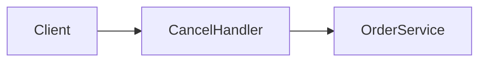
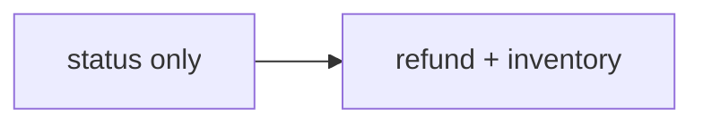
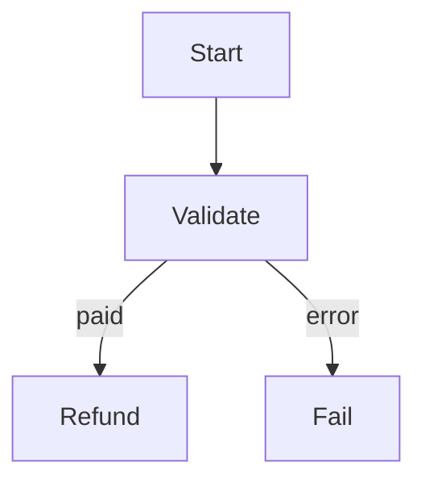

# Examples — Good vs Bad TDD Excerpts

## Brownfield — Good (forward-only)

Ch.3–4 use lead prose and decision cards — not `요약:` / `> **사실:**` (forbidden in Ch.5–6; avoid in Ch.3–4 per current narrative-rules). Full Ch.2 FR/RTM pattern: see **Ch.2 — 요구사항 분석 (Good)** below.

```markdown
## 3. 현재 시스템

B2C 주문 API는 `POST /orders/{id}/cancel` 한 endpoint에서 status만 `cancelled`로 바꾼다. PaymentGateway 호출은 없다.

`CancelHandler`는 JWT 검증 후 `OrderService.cancel`에 위임한다. paid 주문 row에 `payment_intent_id`는 있으나 환불 API는 연결되지 않았다 [ref:A-2].

## 4. 갭과 설계 전환

PRD cancel-flow는 paid 취소 시 자동 환불을 요구한다. 코드는 status 변경만 하므로 환불 연동은 **미구현** 갭이다.

### 환불 연동

취소 API는 paid 상태에서 결제 게이트웨이 환불을 호출해야 PRD cancel-flow를 충족한다.

| 항목 | 내용 |
|------|------|
| 결정 | 취소 API에 PaymentGateway.refund 호출을 추가한다 |
| 상태 | 확정 |
| 코드 | `src/orders/cancel_handler.ts:18` — 현재 status 변경만 |

**근거 설명:** Stripe Refunds API는 payment_intent 기준 환불을 지원하며, paid 주문 row에 payment_intent_id가 이미 저장되어 있다. status-only cancel은 PRD cancel-flow의 paid 시 자동 환불 요구를 만족하지 못한다.

**참고:** [Stripe Refunds API](https://stripe.com/docs/api/refunds) — payment_intent 기준 환불 생성
```

**Why good:** Ch.3 establishes code reality; Ch.4 labels PRD gap; decision card with official URL; no "as above".

---

## Ch.2 — 요구사항 분석 (Good)

```markdown
## 2. 배경과 문제

… (≥8 sentences, 2–4 paragraphs: problem, scope, stakeholders) …

### 요구사항 분석

PRD cancel-flow를 FR 목록과 RTM으로 정제한다. Must FR은 Ch.6 인수조건으로 내려가며, 다음 장에서 코드 대조한다.

#### 기능 요구 (FR)

| FR ID | PRD | 요구 설명 (shall) | 우선순위 | 구현 상태 | 비고 |
|-------|-----|-------------------|----------|-----------|------|
| FR-1 | [source:prd#cancel-flow] | paid 취소 시 전액 환불 선행 | Must | 미구현 | Ch.4 |

#### 추적성 매트릭스 (RTM)

| PRD 앵커 | REQ ID | (예정) AC ID | 설계 반영 (Ch.5–6) | 테스트 |
|----------|--------|--------------|-------------------|--------|
| [source:prd#cancel-flow] | FR-1 | AC-1 | PaymentGateway.refund | T-1 |

## 3. 현재 시스템
```

**Why good:** REQ IDs exist before Ch.4; RTM links PRD → FR → future AC; bridge into Ch.3 without "앞서".

---

## Ch.2 — 요구사항 분석 (Bad)

```markdown
## 2. 배경과 문제

PRD 요구는 위와 같다.

### 요구사항 분석

- 환불 필요
- 재고 복구 필요
```

**Violations:** bullet list instead of FR/RTM tables; no `FR-n` IDs; no `[source:prd#…]`; no bridge sentence to Ch.3.

---

## Brownfield — Bad

```markdown
## 4. 갭과 설계 전환

앞서 설명한 것처럼 환불이 없으므로 Stripe를 붙인다.

> **결정:** Stripe 사용
> **근거:** PRD
```

**Violations:** back-reference "앞서"; Tier-1 without official URL; gap not labeled in Ch.4 introduction.

---

## Greenfield — Good

```markdown
## 3. 시작점

요약: 도메인 코드는 없고, Node 20 + TypeScript 보일러플레이트만 있다.

`package.json`에 express와 typescript가 선언되어 있다. `src/` 디렉터리는 비어 있다. 애플리케이션 서비스나 DB 스키마는 존재하지 않는다.

> **사실:** 런타임 의존성은 express 4.x이다.
> **근거:** [source:prd#stack] + `package.json:14-20`

## 4. 설계 결정

PRD의 REST API 요구에 맞춰 express 라우터 구조를 채택한다.

### API 런타임

Greenfield이므로 PRD stack 제약과 공식 문서 기준으로 단일 프로세스 API를 선택한다.

| 항목 | 내용 |
|------|------|
| 결정 | Express 4 기반 단일 API 프로세스로 시작한다 |
| 상태 | 확정 |
| 코드 | (Greenfield — 코드 없음) |

**근거 설명:** `package.json`에 express 4.x가 이미 선언되어 있어 추가 런타임 도입 없이 PRD REST endpoint를 구현할 수 있다. 단일 프로세스는 MVP 배포·관측 경로를 단순화한다.

**참고:** [Express Routing](https://expressjs.com/en/guide/routing.html) — 라우터·미들웨어 패턴
```

**Why good:** Ch.3 honest empty state; Ch.4 decisions with official URL; no fictional modules.

---

## Greenfield — Bad

```markdown
## 3. 시작점

UserService와 OrderRepository가 src/services에 있다.
```

**Violation:** fabricates modules that do not exist in greenfield repo.

---

## Mixed Audience — Good subsection pattern

```markdown
### 결제 연동

요약: 외부 PG 한 곳만 사용하고, webhook으로 최종 상태를 맞춘다.

Webhook 수신 endpoint는 `POST /webhooks/payment`로 분리한다. 서명 검증은 PG 문서의 HMAC-SHA256 방식을 따른다.
```

First line = PM; rest = dev.

---

## Multiple options — Good (documented fork)

```markdown
## 4. 설계 결정

PRD는 주문·재고·결제 간 일관성을 요구한다. 문서 DB와 RDBMS 모두 기술적으로 가능하나 트랜잭션 모델이 다르다.

### Primary datastore

| 항목 | 내용 |
|------|------|
| 갈림 | Primary datastore |
| 권장 | (A) PostgreSQL |
| 상태 | 권장(미확정) |
| 코드 | (Greenfield — 코드 없음) |

| 대안 | 설명 | 장점 | 단점 | PRD/코드 적합도 |
|------|------|------|------|-----------------|
| (A) PostgreSQL | 관계형 RDBMS | ACID 트랜잭션, JOIN | 스키마 변경 비용 | 높음 — cross-entity 트랜잭션 요구 |
| (B) MongoDB | 문서 DB | 스키마 유연 | 멀ti-doc 트랜잭션 제약 | 낮음 — 주문·재고 동시 갱신 |

**권장 이유:** PRD는 주문 생성 시 재고 차감과 결제 상태를 하나의 유닛으로 처리하도록 명시한다. PostgreSQL 단일 트랜잭션으로 이 흐름을 직접 표현할 수 있다.

**참고:** [PostgreSQL Transactions](https://www.postgresql.org/docs/current/tutorial-transactions.html) — ACID 보장 범위

## 5. 상위설계

요약: PostgreSQL 기준 단일 API + DB 2-tier.

### 아키텍처 개요
…

### 구성요소 및 책임
…

### 데이터 흐름
…

## 6. 상세설계

### API 및 인터페이스
…

### 데이터 모델
PostgreSQL `orders` / `items` draft …

### 핵심 처리 흐름
…

## 7. 마무리

### 롤아웃·일정
…

### 리스크
…

### 열린 질문

- **최종 선택 필요:** Primary datastore — PostgreSQL(권장) vs MongoDB 확정 필요
```

**Why good:** alternatives visible; one To-Be path (권장); open question matches `권장(미확정)`.

---

## Multiple options — Bad

```markdown
## 4. 설계 결정

| 항목 | 내용 |
|------|------|
| 결정 | MongoDB |
| 상태 | 확정 |

**근거 설명:** (missing — URL only)

**참고:** PRD
```

**Violations:** other viable option ignored; Tier-1 without official URL in **참고:**; **근거 설명:** absent or not prose.

---

## Multiple options — Bad (silent auto-pick)

```markdown
## 4. 설계 결정

### 캐시

| 항목 | 내용 |
|------|------|
| 결정 | Redis를 캐시로 사용한다 |
| 상태 | 확정 |

**근거 설명:** 빠르다.

**참고:** https://redis.io/docs/
```

**Violation:** when Kafka/RabbitMQ were equally viable and PRD silent — should be Shape B fork or user confirm first; **근거 설명:** too thin.

---

## Ch.5–6 depth — Good (strict profile)

```markdown
## 5. 상위설계

### 아키텍처 개요

요약: B2C 주문 취소는 API → OrderService → PaymentGateway·InventoryService 3계층으로 처리한다.

클라이언트 요청은 API layer에서 JWT 인증 후 OrderService로 전달된다. Service layer는 상태 전이를 orchestration하고, Data layer는 PostgreSQL orders 테이블을 사용한다. External layer는 Stripe PG와 InventoryService 내부 API를 호출한다.

> **사실:** Stripe refund API는 payment_intent 기준으로 환불을 생성한다.
> **근거:** [source:stripe-refunds](https://stripe.com/docs/api/refunds) + `src/orders/cancel_handler.ts:18`

### 구성요소 및 책임

요약: CancelHandler·OrderService·PaymentGateway·InventoryService 네 구성요소가 취소·환불·재고를 분담한다.

- **CancelHandler** (기존): `POST /orders/{id}/cancel` HTTP, 입력 검증, Idempotency-Key 전달
- **OrderService** (기존): 주문 상태 전이 orchestration, paid 분기에서 PaymentGateway 호출
- **PaymentGateway** (신규): Stripe refund API 호출, PG timeout 시 retry queue enqueue
- **InventoryService** (기존): line item 기준 재고 release

> **사실:** InventoryService.release가 재고 복구를 담당한다.
> **근거:** [source:prd#inventory] + `src/inventory/service.ts:40-55`

### 데이터 흐름

요약: 취소 요청은 인증 → 상태 검증 → (paid 시) 환불 → 재고 복구 → DB 저장 순으로 처리한다.

1. Client → CancelHandler: `POST /orders/{id}/cancel` + JWT
2. CancelHandler → OrderService: cancel(orderId)
3. OrderService: status 검증; paid이면 PaymentGateway.refund (sync)
4. OrderService → InventoryService.release (sync)
5. OrderService → DB: status=cancelled, cancelled_at (sync)

## 6. 상세설계

### API 및 인터페이스

요약: cancel endpoint는 Bearer 인증·idempotent하며 paid일 때만 refund를 트리거한다.

#### `POST /orders/{id}/cancel`

| Field | Type | Required | Note |
|-------|------|----------|------|
| id | path UUID | yes | order id |
| Idempotency-Key | header string | no | duplicate cancel safe |
| Authorization | header Bearer | yes | JWT access token |

| Code | HTTP | When | Client action | Retry? |
|------|------|------|---------------|--------|
| ORDER_NOT_FOUND | 404 | invalid id | fix request | no |
| ALREADY_CANCELLED | 409 | status cancelled | show status | no |
| PAYMENT_TIMEOUT | 502 | PG timeout | retry with same key | yes |

> **사실:** Idempotency-Key 중복 시 동일 200 응답을 반환한다.
> **근거:** [source:stripe-idempotency](https://stripe.com/docs/api/idempotent_requests) + `src/orders/cancel_handler.ts:8`

### 데이터 모델

요약: orders 테이블에 cancelled_at을 추가하고 status enum을 PRD와 일치시킨다.

#### `orders`

| Field | Type | Nullable | Constraint | Notes |
|-------|------|----------|------------|-------|
| id | uuid | no | PK | |
| status | enum | no | pending/paid/cancelled/… | PRD §order-status |
| payment_intent_id | string | yes | FK logical → Stripe | paid orders only |
| cancelled_at | timestamptz | yes | set on cancel | migration V004 |

> **사실:** status enum은 pending, paid, shipped, delivered, cancelled 다섯 값이다.
> **근거:** [source:prd#order-status] + `src/orders/state.ts:12-28`

### 핵심 처리 흐름

요약: OrderService.cancel이 happy path와 PG·재고 실패 분기를 처리한다.

**Happy path:** Load order → reject if cancelled → if paid call PaymentGateway.refund → InventoryService.release → persist cancelled + cancelled_at.

**Errors:**
- PaymentGateway timeout → enqueue retry job, return 502 PAYMENT_TIMEOUT; client may retry with Idempotency-Key
- InventoryService.release failure → rollback refund (compensating call), return 500 INVENTORY_RELEASE_FAILED; no status change

### 인수조건

AC rows state verifiable done criteria so QA can judge implementation completeness without reading code.

| AC ID | PRD | 인수조건 | 우선순위 | 완료 판정 |
|-------|-----|----------|----------|-----------|
| AC-1 | [source:prd#cancel-flow] | Given paid order, When POST cancel, Then refund + status=cancelled | Must | T-1 CI green |
| AC-2 | [source:prd#cancel-flow] | Given cancelled order, When POST cancel, Then 409 and no second refund | Must | T-2 CI green |

### 테스트

| Test ID | AC ID | Layer | 시나리오 | Fixture / Mock | CI gate |
|---------|-------|-------|----------|----------------|---------|
| T-1 | AC-1 | integration | paid cancel happy path | stripe mock | yes |
| T-2 | AC-2 | unit | duplicate cancel conflict | OrderService fixture | yes |
```

**Why good:** every ### has lead prose + depth; components labeled; API + error tables; ≥2 error branches; AC + tests prove done; Ch.5 names reused in Ch.6.

---

## Ch.5–6 depth — Bad (passes old validator, fails strict)

```markdown
## 5. 상위설계

### 아키텍처 개요
단일 API + DB.

### 구성요소 및 책임
- ApiServer: HTTP
- DB: storage

### 데이터 흐름
Client → ApiServer → DB

## 6. 상세설계

### API 및 인터페이스
`GET /health` — liveness

### 데이터 모델
`items(id, name)`

### 핵심 처리 흐름
Health check returns 200.
```

**Violations:** no 요약; <2 components with names; 1-line data flow; no API table; no error branches; no ### 인수조건 or ### 테스트; no `[ref:A-n]` / Appendix A; happy-path only.

---

## Narrative — Good

```markdown
## 2. 배경과 문제

고객은 B2C 웹몰에서 결제 전후 특정 조건에서 주문을 취소할 수 있어야 한다.
PRD는 취소 시 재고 복구와 paid 상태 환불을 동시에 요구한다.
범위는 공개 주문 API이며 B2B bulk cancel은 포함하지 않는다.
…（8문장 이상，요약: 없음）

## 5. 상위설계

### 아키텍처 개요

Ch.4에서 확정한 Stripe 환불 연동에 따라 취소 요청은 얇은 HTTP 경계 뒤 OrderService가 orchestration한다.
JWT 인증된 클라이언트만 CancelHandler에 도달하며, paid 분기에서 PaymentGateway를 호출한다.



## 6. 상세설계

아래 표는 implementer가 먼저 볼 endpoint·entity·에러 코드 매핑이다.

| POST /orders/{id}/cancel | orders | 404, 409, 502 |

### API 및 인터페이스

CancelHandler는 Bearer JWT를 검증한 뒤 OrderService.cancel에 위임한다.

| Field | Type | … |
```

**Why good:** Ch.2–4 story prose; lead sentences before structure; no meta-labels; `[ref:A-n]` + Appendix A.

---

## Narrative — Bad

```markdown
## 2. 배경과 문제

요약: PRD requires cancel.

## 5. 상위설계

### 아키텍처 개요

요약: layers…

#### 한눈에
- bullet
```

**Violations:** `요약:` / `#### 한눈에`; Ch.2 telegraphic; no chapter bridges; `<8` sentences in Ch.2–4.

---

## Front matter — Good (H2 before Ch.1)

```markdown
# 주문 취소 API 기술설계서

## 목차

1. 서문 …
2. 배경과 문제 …

## 이 문서 읽는 법

- PM: Ch.2–4, Ch.4 `### 결정 요약`
- Dev: Ch.5–6, 부록 A

## 1. 서문

고객은 결제 전후 특정 조건에서 주문을 취소할 수 있어야 한다.
…（opening ≥3 sentences）

### Goals
…
```

**Why good:** `## 목차` → `## 이 문서 읽는 법` → `## 1. 서문`; no prose before `## 목차`; Ch.1 has opening + Goals only.

---

## Front matter — Bad (nested under Ch.1)

```markdown
## 1. 서문

### 목차
…

### 이 문서 읽는 법
…

고객은 …
```

**Violations:** TOC/reader paths inside Ch.1 as `###`; scan-first blocks buried under 서문.

---

## Ch.2–4 paragraphs — Good

```markdown
## 2. 배경과 문제

고객은 B2C 웹몰에서 결제 전후 주문을 취소할 수 있어야 한다. PRD는 취소 시 재고 복구와 paid 상태 환불을 동시에 요구한다.

현재 API는 status만 `cancelled`로 바꾸며 환불·재고 연동이 없다. 운영팀은 수동 환불 티켓으로 처리하고 있어 SLA를 맞추기 어렵다.

범위는 공개 주문 API이며 B2B bulk cancel은 포함하지 않는다. …（≥8 sentences total, 2–4 paragraphs, blank lines between）
```

**Why good:** 2–4 paragraphs; blank lines; no run-on wall (≥5 sentences in one paragraph).

---

## Ch.2–4 paragraphs — Bad (run-on)

```markdown
## 2. 배경과 문제

고객은 취소가 필요하다. PRD는 환불을 요구한다. 현재는 status만 바꾼다. 운영은 수동이다. 범위는 B2C이다. B2B는 제외이다. …（한 단락에 5문장 이상）
```

**Violation:** `ch234-paragraph-runon` under `--narrative`.

---

## Flow diagrams — Good (four locations)

```markdown
## 4. 갭과 설계 전환

…（prose）



### 결정 요약
| … |

## 5. 상위설계

### 아키텍처 개요
… + ```mermaid flowchart …```

### 데이터 흐름
… + ```mermaid sequenceDiagram …```

## 6. 상세설계

### 핵심 처리 흐름



**Why good:** Ch.4 transition before `### 결정 요약`; Ch.5 arch + data flow; Ch.6 flow with error branch.

---

## Flow diagrams — Bad

```markdown
## 4. 갭과 설계 전환

### 결정 요약
（mermaid 없음）

## 5. 상위설계

### 아키텍처 개요
단일 API + DB.（mermaid 없음 — strict도 실패）

## 6. 상세설계

### 핵심 처리 흐름
Happy path only, no mermaid.
```

**Violations:** missing required mermaid blocks; Ch.6 no error branch in diagram.
