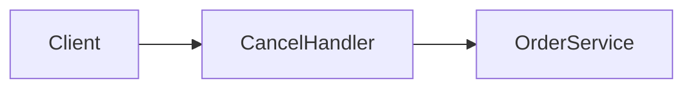

# Examples — Good vs Bad TDD Excerpts

## Brownfield — Good (forward-only)

```markdown
## 3. 현재 시스템

요약: 주문 취소는 API 한 endpoint에서 상태만 바꾸며, 환불은 호출하지 않는다.

`POST /orders/{id}/cancel` 핸들러는 `OrderService.cancel`을 호출한다.

> **사실:** 취소 시 status만 `cancelled`로 변경한다.
> **근거:** [source:prd#cancel-flow] + `src/orders/cancel_handler.ts:8-22`

## 4. 갭과 설계 전환

요약: PRD는 환불 연동을 요구하지만, 코드에는 결제 모듈 호출이 없다.

PRD는 취소 시 자동 환불을 요구한다. 코드는 status 변경만 수행하므로 환불 연동은 미구현이다.

> **결정:** 취소 API에 PaymentGateway.refund 호출을 추가한다.
> **근거:** [source:stripe-refunds](https://stripe.com/docs/api/refunds)
> **코드:** `src/orders/cancel_handler.ts:18` (현재 status 변경만)
```

**Why good:** Ch.3 establishes code reality; Ch.4 first mentions PRD gap; no "as above".

---

## Brownfield — Bad

```markdown
## 4. 갭과 설계 전환

앞서 설명한 것처럼 환불이 없으므로 Stripe를 붙인다.

> **결정:** Stripe 사용
> **근거:** PRD
```

**Violations:** back-reference "앞서"; Tier-1 without official URL; gap not labeled in Ch.4 introduction.

---

## Greenfield — Good

```markdown
## 3. 시작점

요약: 도메인 코드는 없고, Node 20 + TypeScript 보일러플레이트만 있다.

`package.json`에 express와 typescript가 선언되어 있다. `src/` 디렉터리는 비어 있다. 애플리케이션 서비스나 DB 스키마는 존재하지 않는다.

> **사실:** 런타임 의존성은 express 4.x이다.
> **근거:** [source:prd#stack] + `package.json:14-20`

## 4. 설계 결정

요약: PRD의 REST API 요구에 맞춰 express 라우터 구조를 채택한다.

> **결정:** Express 4 기반 단일 API 프로세스로 시작한다.
> **근거:** [source:express-routing](https://expressjs.com/en/guide/routing.html)
> **코드:** (Greenfield — 코드 없음)
```

**Why good:** Ch.3 honest empty state; Ch.4 decisions with official URL; no fictional modules.

---

## Greenfield — Bad

```markdown
## 3. 시작점

UserService와 OrderRepository가 src/services에 있다.
```

**Violation:** fabricates modules that do not exist in greenfield repo.

---

## Mixed Audience — Good subsection pattern

```markdown
### 결제 연동

요약: 외부 PG 한 곳만 사용하고, webhook으로 최종 상태를 맞춘다.

Webhook 수신 endpoint는 `POST /webhooks/payment`로 분리한다. 서명 검증은 PG 문서의 HMAC-SHA256 방식을 따른다.
```

First line = PM; rest = dev.

---

## Multiple options — Good (documented fork)

```markdown
## 4. 설계 결정

요약: 저장소는 PostgreSQL과 MongoDB가 모두 가능하나, 트랜잭션 요구로 PostgreSQL을 권장한다.

PRD는 주문·재고·결제 간 일관성을 요구한다. 스키마 유연성만으로는 이 요구를 충족하기 어렵다.

> **갈림:** Primary datastore
> **대안:** (A) PostgreSQL — ACID 트랜잭션 (B) MongoDB — 문서 기반 유연 스키마
> **권장:** (A) PostgreSQL — PRD의 cross-entity 트랜잭션 요구
> **근거:** [source:postgresql-transactions](https://www.postgresql.org/docs/current/tutorial-transactions.html)
> **코드:** (Greenfield — 코드 없음)
> **상태:** 권장(미확정)

## 5. 상위설계

요약: PostgreSQL 기준 단일 API + DB 2-tier.

### 아키텍처 개요
…

### 구성요소 및 책임
…

### 데이터 흐름
…

## 6. 상세설계

### API 및 인터페이스
…

### 데이터 모델
PostgreSQL `orders` / `items` draft …

### 핵심 처리 흐름
…

## 7. 마무리

### 롤아웃·일정
…

### 리스크
…

### 열린 질문

- **최종 선택 필요:** Primary datastore — PostgreSQL(권장) vs MongoDB 확정 필요
```

**Why good:** alternatives visible; one To-Be path (권장); open question matches `권장(미확정)`.

---

## Multiple options — Bad

```markdown
## 4. 설계 결정

PostgreSQL 또는 MongoDB를 사용할 수 있다. MongoDB로 진행한다.

> **결정:** MongoDB
```

**Violations:** other viable option ignored without `**갈림:**`; no rationale for rejecting PostgreSQL when PRD implies transactions.

---

## Multiple options — Bad (silent auto-pick)

```markdown
## 4. 설계 결정

> **결정:** Redis를 캐시로 사용한다.
```

**Violation:** when Kafka/RabbitMQ were equally viable and PRD silent — should be `**갈림:**` or user confirm first.

---

## Ch.5–6 depth — Good (strict profile)

```markdown
## 5. 상위설계

### 아키텍처 개요

요약: B2C 주문 취소는 API → OrderService → PaymentGateway·InventoryService 3계층으로 처리한다.

클라이언트 요청은 API layer에서 JWT 인증 후 OrderService로 전달된다. Service layer는 상태 전이를 orchestration하고, Data layer는 PostgreSQL orders 테이블을 사용한다. External layer는 Stripe PG와 InventoryService 내부 API를 호출한다.

> **사실:** Stripe refund API는 payment_intent 기준으로 환불을 생성한다.
> **근거:** [source:stripe-refunds](https://stripe.com/docs/api/refunds) + `src/orders/cancel_handler.ts:18`

### 구성요소 및 책임

요약: CancelHandler·OrderService·PaymentGateway·InventoryService 네 구성요소가 취소·환불·재고를 분담한다.

- **CancelHandler** (기존): `POST /orders/{id}/cancel` HTTP, 입력 검증, Idempotency-Key 전달
- **OrderService** (기존): 주문 상태 전이 orchestration, paid 분기에서 PaymentGateway 호출
- **PaymentGateway** (신규): Stripe refund API 호출, PG timeout 시 retry queue enqueue
- **InventoryService** (기존): line item 기준 재고 release

> **사실:** InventoryService.release가 재고 복구를 담당한다.
> **근거:** [source:prd#inventory] + `src/inventory/service.ts:40-55`

### 데이터 흐름

요약: 취소 요청은 인증 → 상태 검증 → (paid 시) 환불 → 재고 복구 → DB 저장 순으로 처리한다.

1. Client → CancelHandler: `POST /orders/{id}/cancel` + JWT
2. CancelHandler → OrderService: cancel(orderId)
3. OrderService: status 검증; paid이면 PaymentGateway.refund (sync)
4. OrderService → InventoryService.release (sync)
5. OrderService → DB: status=cancelled, cancelled_at (sync)

## 6. 상세설계

### API 및 인터페이스

요약: cancel endpoint는 Bearer 인증·idempotent하며 paid일 때만 refund를 트리거한다.

#### `POST /orders/{id}/cancel`

| Field | Type | Required | Note |
|-------|------|----------|------|
| id | path UUID | yes | order id |
| Idempotency-Key | header string | no | duplicate cancel safe |
| Authorization | header Bearer | yes | JWT access token |

| Code | HTTP | When | Client action | Retry? |
|------|------|------|---------------|--------|
| ORDER_NOT_FOUND | 404 | invalid id | fix request | no |
| ALREADY_CANCELLED | 409 | status cancelled | show status | no |
| PAYMENT_TIMEOUT | 502 | PG timeout | retry with same key | yes |

> **사실:** Idempotency-Key 중복 시 동일 200 응답을 반환한다.
> **근거:** [source:stripe-idempotency](https://stripe.com/docs/api/idempotent_requests) + `src/orders/cancel_handler.ts:8`

### 데이터 모델

요약: orders 테이블에 cancelled_at을 추가하고 status enum을 PRD와 일치시킨다.

#### `orders`

| Field | Type | Nullable | Constraint | Notes |
|-------|------|----------|------------|-------|
| id | uuid | no | PK | |
| status | enum | no | pending/paid/cancelled/… | PRD §order-status |
| payment_intent_id | string | yes | FK logical → Stripe | paid orders only |
| cancelled_at | timestamptz | yes | set on cancel | migration V004 |

> **사실:** status enum은 pending, paid, shipped, delivered, cancelled 다섯 값이다.
> **근거:** [source:prd#order-status] + `src/orders/state.ts:12-28`

### 핵심 처리 흐름

요약: OrderService.cancel이 happy path와 PG·재고 실패 분기를 처리한다.

**Happy path:** Load order → reject if cancelled → if paid call PaymentGateway.refund → InventoryService.release → persist cancelled + cancelled_at.

**Errors:**
- PaymentGateway timeout → enqueue retry job, return 502 PAYMENT_TIMEOUT; client may retry with Idempotency-Key
- InventoryService.release failure → rollback refund (compensating call), return 500 INVENTORY_RELEASE_FAILED; no status change

> **사실:** PG timeout 시 retry queue에 refund job을 적재한다.
> **근거:** [source:prd#cancel-flow] + `src/orders/cancel_handler.ts:18`
```

**Why good:** every ### has 요약 + depth; components labeled; API + error tables; ≥2 error branches; Ch.5 names reused in Ch.6.

---

## Ch.5–6 depth — Bad (passes old validator, fails strict)

```markdown
## 5. 상위설계

### 아키텍처 개요
단일 API + DB.

### 구성요소 및 책임
- ApiServer: HTTP
- DB: storage

### 데이터 흐름
Client → ApiServer → DB

## 6. 상세설계

### API 및 인터페이스
`GET /health` — liveness

### 데이터 모델
`items(id, name)`

### 핵심 처리 흐름
Health check returns 200.
```

**Violations:** no 요약; <2 components with names; 1-line data flow; no API table; no error branches; no `[ref:A-n]` / Appendix A; happy-path only.

---

## Narrative — Good

```markdown
## 2. 배경과 문제

고객은 B2C 웹몰에서 결제 전후 특정 조건에서 주문을 취소할 수 있어야 한다.
PRD는 취소 시 재고 복구와 paid 상태 환불을 동시에 요구한다.
범위는 공개 주문 API이며 B2B bulk cancel은 포함하지 않는다.
…（8문장 이상，요약: 없음）

## 5. 상위설계

### 아키텍처 개요

Ch.4에서 확정한 Stripe 환불 연동에 따라 취소 요청은 얇은 HTTP 경계 뒤 OrderService가 orchestration한다.
JWT 인증된 클라이언트만 CancelHandler에 도달하며, paid 분기에서 PaymentGateway를 호출한다.



## 6. 상세설계

아래 표는 implementer가 먼저 볼 endpoint·entity·에러 코드 매핑이다.

| POST /orders/{id}/cancel | orders | 404, 409, 502 |

### API 및 인터페이스

CancelHandler는 Bearer JWT를 검증한 뒤 OrderService.cancel에 위임한다.

| Field | Type | … |
```

**Why good:** Ch.2–4 story prose; lead sentences before structure; no meta-labels; `[ref:A-n]` + Appendix A.

---

## Narrative — Bad

```markdown
## 2. 배경과 문제

요약: PRD requires cancel.

## 5. 상위설계

### 아키텍처 개요

요약: layers…

#### 한눈에
- bullet
```

**Violations:** `요약:` / `#### 한눈에`; Ch.2 telegraphic; no chapter bridges; `<8` sentences in Ch.2–4.
