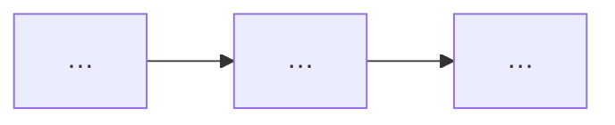

# TDD Output Template

Copy this skeleton. Replace `{{placeholders}}`. Write chapters **in order**; complete one before starting the next.

Complete [outline-template.md](outline-template.md) **before** filling this template.

```markdown
---
title: "TDD: {{feature_title}}"
feature: {{feature_slug}}
mode: {{brownfield|greenfield}}
prd_source: "{{path_or_google_docs_url}}"
generated_at: {{YYYY-MM-DD}}
validation_passed: false
review_rounds: 0
---

# {{feature_title}} — Technical Design Document

## 목차

1. [서문](#1-서문)
…

## 이 문서 읽는 법

| 독자 | 먼저 볼 곳 | 목표 |
|------|-----------|------|
| PM | ## 1. 서문 opening + Goals → [§2 요구사항 분석](#요구사항-분석) → [§5](#5-상위설계) diagram | \~3분 |
| Dev | [§2 요구사항 분석](#요구사항-분석) → [§4](#4-갭과-설계-전환) → [§6](#6-상세설계) tables | \~5분 |
| QA | [§2](#2-배경과-문제) RTM → [§6](#6-상세설계) [인수조건](#인수조건) → [테스트](#테스트) | \~3분 |
| 감사 | [§4](#4-갭과-설계-전환) 결정 요약 → [부록 A](#부록-a-출처코드-위치) | \~3분 |

## 1. 서문

{{3–5 sentences: who needs this, why now, PRD source, expected outcome, rollout hint. No ### TL;DR.}}

### Goals / Non-Goals

**Goals:**
- …
- …

**Non-Goals:**
- …

## 2. 배경과 문제

{{≥8 sentences in 2–4 paragraphs (blank line between paragraphs); no `요약:` prefix}}

### 요구사항 분석

{{≥2 sentences: PRD를 FR/NFR/제약으로 정제했으며, Ch.6 인수조건의 상위 목록이다. 마지막 문장은 Ch.3 현재 시스템 대조로 이어지게 쓴다.}}

#### 기능 요구 (FR)

| FR ID | PRD | 요구 설명 (shall) | 우선순위 | 구현 상태 | 비고 |
|-------|-----|-------------------|----------|-----------|------|
| FR-1 | [source:prd#…] | … | Must | 미구현 | Ch.4 갭 |

<!-- Brownfield: 구현 상태 = 구현됨 / 부분 / 미구현 / PRD-only / 코드-only(문서화). Greenfield: 열 생략 또는 N/A -->

#### 비기능 요구 (NFR)

| NFR ID | PRD | 요구 | 목표치 | 검증 방법 (개략) |
|--------|-----|------|--------|------------------|
| NFR-1 | [source:prd#…] | … | … | … |

#### 제약·가정·의존성

| 유형 | ID | 내용 | 영향 |
|------|-----|------|------|
| 제약 | CON-1 | … | 범위 |
| 가정 | ASM-1 | … | Ch.4 |
| 의존성 | DEP-1 | … | 통합 |

#### 모호·충돌·미결

| ID | 유형 | 설명 | 처리 |
|----|------|------|------|
| OQ-1 | 모호 | … | Ch.7 열린 질문 |

#### 추적성 매트릭스 (RTM)

| PRD 앵커 | REQ ID | (예정) AC ID | 설계 반영 (Ch.5–6) | 테스트 |
|----------|--------|--------------|-------------------|--------|
| [source:prd#…] | FR-1 | AC-1 | … | T-1 |

## 3. 현재 시스템

<!-- Brownfield. Greenfield: "## 3. 시작점" -->
{{≥8 sentences in 2–4 paragraphs — bridge from Ch.2}}

## 4. 갭과 설계 전환

<!-- Greenfield: "## 4. 설계 결정" -->
{{≥8 sentences in 2–4 paragraphs — bridge to Ch.5}}



### 결정 요약

| # | 주제 | 선택 | 상태 | 근거 한줄 |
|---|------|------|------|-----------|
| 1 | … | … | 확정 | … |

### {{decision_topic_1}}

{{1–2 sentences: why this topic matters}}

| 항목 | 내용 |
|------|------|
| 결정 | … |
| 상태 | 확정 |
| 코드 | `path:line` or (Greenfield — 코드 없음) |

**근거 설명:** {{≥2 sentences — why this choice; not links alone}}

**참고:** [label](https://official-doc) — one-line annotation

<!-- Fork example (Shape B): replace metadata table + add alternatives table -->

<!--
### {{fork_topic}}

| 항목 | 내용 |
|------|------|
| 갈림 | … |
| 권장 | (A) … |
| 상태 | 권장(미확정) |
| 코드 | … |

| 대안 | 설명 | 장점 | 단점 | PRD/코드 적합도 |
|------|------|------|------|-----------------|
| (A) … | … | … | … | … |
| (B) … | … | … | … | … |

**권장 이유:** …

**참고:** …
-->

## 5. 상위설계

{{Chapter intro prose optional}}

### 아키텍처 개요

{{≥2 sentences: why this architecture follows Ch.4. Then mermaid.}}

```mermaid
flowchart LR
  …
```

### 구성요소 및 책임

{{≥2 sentences. Then component bullets `(신규|기존)`.}}

### 데이터 흐름

{{≥2 sentences. Then mermaid sequence/flow, then optional numbered steps.}}

```mermaid
sequenceDiagram
  …
```

## 6. 상세설계

{{Optional dev index table after chapter intro — no ### heading}}

### API 및 인터페이스

{{≥1 sentence before tables}}

### 데이터 모델

{{≥1 sentence before tables}}

### 핵심 처리 흐름

{{≥1 sentence before mermaid + error branches}}

```mermaid
flowchart TD
  …
```

### 인수조건

{{≥1 sentence: AC define verifiable “done”; each row traces to PRD [source:prd#…]}}

| AC ID | PRD | 인수조건 | 우선순위 | 완료 판정 |
|-------|-----|----------|----------|-----------|
| AC-1 | [source:prd#…] | Given … When … Then … | Must | Test T-1 passes in CI |

### 테스트

{{≥1 sentence: test layers prove AC; brownfield cite existing test paths}}

| Test ID | AC ID | Layer | 시나리오 | Fixture / Mock | CI gate |
|---------|-------|-------|----------|----------------|---------|
| T-1 | AC-1 | integration | … | … | yes |

## 7. 마무리

### 롤아웃·일정
…

### 리스크
| Risk | Impact | Mitigation |
|------|--------|------------|

### 열린 질문
- …

## 부록 A. 출처·코드 위치
| ID | 주장 | PRD | Code | External URL |

## 부록 B. Ch.4 결정 전문

{{Copy each Ch.4 `### {주제}` decision card verbatim — metadata table + prose + alternatives table if fork}}
```
