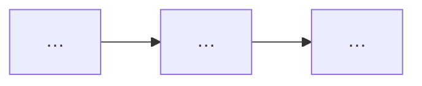

# TDD Output Template (Google Design Doc)

Copy this skeleton. Replace `{{placeholders}}`. Write chapters **1 → 8 in order**; for design depth, draft **Ch.5 → Ch.6 → Ch.7** after Ch.1–4.

Complete [outline-template.md](outline-template.md) before filling sections.

```markdown
---
title: "Design Doc: {{feature_title}}"
feature: {{feature_slug}}
mode: {{brownfield|greenfield}}
prd_source: "{{path_or_google_docs_url}}"
generated_at: {{YYYY-MM-DD}}
validation_passed: false
review_rounds: 0
prd_to_tdd_path: {{standard|enhanced|full}}
complexity_score: {{N}}
---

# {{feature_title}} — Design Document

## 목차

1. [Overview](#1-overview)
2. [Background](#2-background)
3. [Requirements](#3-requirements)
4. [Existing Solution](#4-existing-solution) <!-- greenfield: [Starting Point](#4-starting-point) -->
5. [Proposed Solution](#5-proposed-solution)
6. [Alternatives Considered](#6-alternatives-considered)
7. [Detailed Design](#7-detailed-design)
8. [Rollout and Open Items](#8-rollout-and-open-items)

## How to Read This Doc

| Reader | Start here | Goal |
|--------|------------|------|
| PM | Ch.1 Overview + Goals → Ch.3 Requirements → Ch.5 diagram | \\~3 min |
| Dev (build) | Ch.5 → Ch.6 → Ch.7 tables | \\~5 min |
| Dev (linear) | Ch.3 RTM → Ch.5 → Ch.6 → Ch.7 | \\~8 min |
| QA | Ch.3 RTM → Ch.7 Acceptance Criteria → Tests | \\~3 min |
| Audit | Ch.6 Decision Summary → Appendix A | \\~3 min |

## 1. Overview

{{3–5 sentences: audience, why now, PRD source, expected outcome. No ### TL;DR.}}

### Goals / Non-Goals

**Goals:**
- …

**Non-Goals:**
- …

## 2. Background

{{≥8 sentences in 2–4 paragraphs; problem, scope, motivation; no requirement tables here.}}

## 3. Requirements

{{≥2 sentences: PRD refined into traceable IDs; bridge into Ch.4 Existing/Starting Point.}}

#### Functional Requirements (FR)

| FR ID | PRD | Requirement (shall) | Priority | Impl. status | Notes |
|-------|-----|---------------------|----------|--------------|-------|
| FR-1 | [source:prd#…] | … | Must | 미구현 | Ch.5 gap |

<!-- Brownfield: Impl. status = 구현됨/부분/미구현/PRD-only/코드-only. Greenfield: omit column or N/A -->

#### Non-Functional Requirements (NFR)

| NFR ID | PRD | Requirement | Target | Verification (draft) |
|--------|-----|-------------|--------|----------------------|
| NFR-1 | [source:prd#…] | … | … | … |

#### Constraints / Assumptions / Dependencies

| Type | ID | Content | Impact |
|------|-----|---------|--------|
| Constraint | CON-1 | … | Scope |

#### Ambiguity / Conflicts / Open (draft)

| ID | Type | Description | Handling |
|----|------|-------------|----------|
| OQ-1 | Ambiguous | … | Ch.8 |

#### Traceability Matrix (RTM)

| PRD anchor | REQ ID | (planned) AC ID | Design hook (Ch.6–7) | Test ID |
|------------|--------|-----------------|----------------------|---------|
| [source:prd#…] | FR-1 | AC-1 | … | T-1 |

## 4. Existing Solution

<!-- Greenfield title: ## 4. Starting Point -->
{{≥8 sentences in 2–4 paragraphs — what exists today; bridge to Ch.5 gap}}

## 5. Proposed Solution

{{≥8 sentences: gap, direction, why this architecture closes FR gaps}}



### Architecture Overview

{{≥2 sentences, then mermaid}}

```mermaid
flowchart LR
  …
```

### Components and Responsibilities

{{≥2 sentences, then bullets `(new|existing)`}}

### Data Flow

{{≥2 sentences, then mermaid + numbered steps}}

```mermaid
sequenceDiagram
  …
```

## 6. Alternatives Considered

{{≥2 sentences: Tier-1 choices that **implement Ch.5**; do not repeat HLD diagrams.}}

### Decision Summary

| # | Topic | Choice | Status | One-line rationale |
|---|-------|--------|--------|-------------------|
| 1 | … | … | Confirmed | … |

### {{decision_topic_1}}

{{Shape A/B card per citation-tiers.md}}

## 7. Detailed Design

{{Optional dev index table after intro — no ### heading}}

### APIs and Interfaces

### Data Model

### Core Processing Flow

```mermaid
flowchart TD
  …
```

### Cross-cutting Concerns

{{Security, privacy, observability — short prose blocks}}

### Acceptance Criteria

| AC ID | PRD | Criterion (Given/When/Then) | Priority | Done when |
|-------|-----|------------------------------|----------|-----------|
| AC-1 | [source:prd#…] | Given … When … Then … | Must | T-1 passes in CI |

### Tests

| Test ID | AC ID | Layer | Scenario | Fixture / Mock | CI gate |
|---------|-------|-------|----------|------------------|---------|
| T-1 | AC-1 | integration | … | … | yes |

## 8. Rollout and Open Items

### Rollout and Milestones

### Risks

| Risk | Impact | Mitigation |
|------|--------|------------|

### Open Questions

- …

## Appendix A. Sources and Code Locations

| ID | Claim | PRD | Code | External URL |

## Appendix B. Ch.6 Decision Cards (verbatim)

{{Copy each Ch.6 `### {topic}` decision card}}
```
