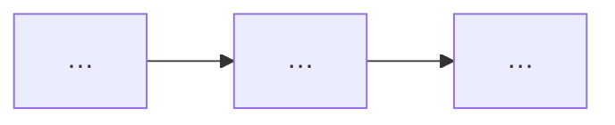

# TDD Output Template

Copy this skeleton. Replace `{{placeholders}}`. Write chapters **in order**; complete one before starting the next.

Complete [outline-template.md](outline-template.md) **before** filling this template.

```markdown
---
title: "TDD: {{feature_title}}"
feature: {{feature_slug}}
mode: {{brownfield|greenfield}}
prd_source: "{{path_or_google_docs_url}}"
generated_at: {{YYYY-MM-DD}}
validation_passed: false
review_rounds: 0
---

# {{feature_title}} — Technical Design Document

## 목차

1. [서문](#1-서문)
…

## 이 문서 읽는 법

| 독자 | 먼저 볼 곳 | 목표 |
|------|-----------|------|
| PM | ## 1. 서문 opening + Goals → [§5](#5-상위설계) diagram | ~3분 |
| Dev | [§4](#4-갭과-설계-전환) → [§6](#6-상세설계) tables | ~5분 |
| 감사 | [§4](#4-갭과-설계-전환) 결정 요약 → [부록 A](#부록-a-출처코드-위치) | ~3분 |

## 1. 서문

{{3–5 sentences: who needs this, why now, PRD source, expected outcome, rollout hint. No ### TL;DR.}}

### Goals / Non-Goals

**Goals:**
- …
- …

**Non-Goals:**
- …

## 2. 배경과 문제

{{≥8 sentences in 2–4 paragraphs (blank line between paragraphs); no `요약:` prefix}}

## 3. 현재 시스템

<!-- Brownfield. Greenfield: "## 3. 시작점" -->
{{≥8 sentences in 2–4 paragraphs — bridge from Ch.2}}

## 4. 갭과 설계 전환

<!-- Greenfield: "## 4. 설계 결정" -->
{{≥8 sentences in 2–4 paragraphs — bridge to Ch.5}}



### 결정 요약

| # | 주제 | 선택 | 상태 | 상세 |
|---|------|------|------|------|
| 1 | … | … | 확정 | … |

> **결정:** …
> **근거:** …
> **코드:** …
> **상태:** 확정

## 5. 상위설계

{{Chapter intro prose optional}}

### 아키텍처 개요

{{≥2 sentences: why this architecture follows Ch.4. Then mermaid.}}

```mermaid
flowchart LR
  …
```

### 구성요소 및 책임

{{≥2 sentences. Then component bullets `(신규|기존)`.}}

### 데이터 흐름

{{≥2 sentences. Then mermaid sequence/flow, then optional numbered steps.}}

```mermaid
sequenceDiagram
  …
```

## 6. 상세설계

{{Optional dev index table after chapter intro — no ### heading}}

### API 및 인터페이스

{{≥1 sentence before tables}}

### 데이터 모델

{{≥1 sentence before tables}}

### 핵심 처리 흐름

{{≥1 sentence before mermaid + error branches}}

```mermaid
flowchart TD
  …
```

## 7. 마무리

### 롤아웃·일정
…

### 리스크
| Risk | Impact | Mitigation |
|------|--------|------------|

### 열린 질문
- …

## 부록 A. 출처·코드 위치
| ID | 주장 | PRD | Code | External URL |

## 부록 B. Ch.4 결정 전문
> **결정:** …
```
